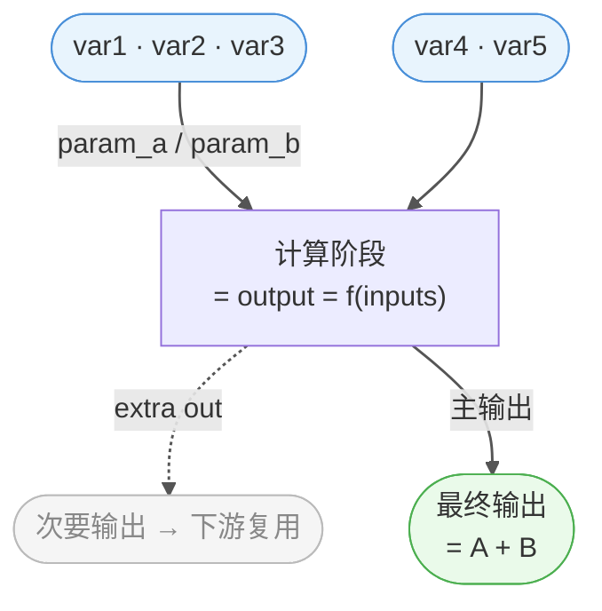
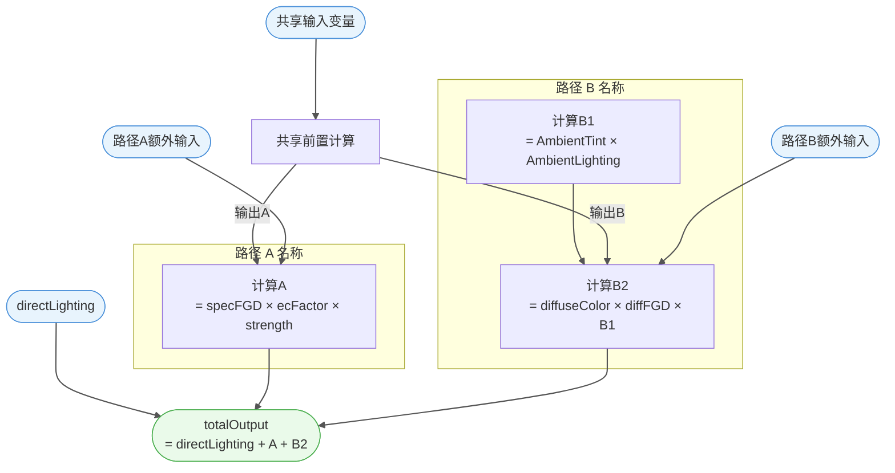
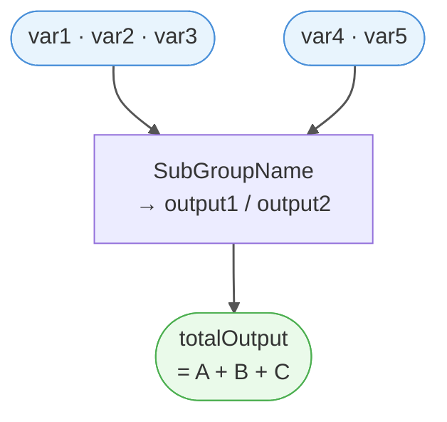

# 输出文件参考手册

> 每次分析新材质前必读，确保输出路径、命名和文件结构保持一致。
> 更新日期：2026-02-27 | 当前基准材质：`M_actor_pelica_cloth_04`

---

## 目录结构总览

```
shader-migration/
├── README.md                          # 工程概述与工作流
├── docs/
│   ├── OUTPUT_REFERENCE.md            # 本文件
│   ├── raw_data/                      # Phase 1：Blender 原始提取 JSON
│   └── analysis/                      # Phase 1：分析文档
│       ├── <MATERIAL_SAFE_NAME>/      # 每个材质一个子目录
│       │   ├── 00_material_overview.md
│       │   └── 01_shader_arch.md
│       ├── frames/                   # Frame 深度分析（跨材质共享）
│       │   └── Frame<NNN>_<ModuleName>.md
│       └── sub_groups/               # 子群组文档（跨材质共享）
│           └── <SubGroupName>.md
├── hlsl/                              # Phase 2：HLSL 代码
│   └── <MATERIAL_SAFE_NAME>/
│       ├── <MaterialName>_Input.hlsl
│       ├── SubGroups/
│       │   └── SubGroups.hlsl
│       └── <MaterialName>.hlsl
├── unity/                             # Phase 3：Unity URP ShaderLab
│   └── Shaders/
│       └── <MaterialName>.shader
└── scripts/
    └── extract_nodes.py               # Blender MCP 提取脚本
```

---

## 命名约定

| 变量 | 说明 | 示例 |
|------|------|------|
| `<MATERIAL_SAFE_NAME>` | 材质名去掉特殊字符，用下划线连接 | `M_actor_pelica_cloth_04` |
| `<GROUP_SAFE_NAME>` | 群组名替换 `:` 和空格为 `_` | `Arknights__Endfield_PBRToonBase` |
| `<MaterialName>` | 主群组的功能名，去掉前缀 | `PBRToonBase` |
| `<TODAY>` | 提取日期，格式 `YYYYMMDD` | `20260227` |
| `<NNN>` | Frame 编号，三位数字（与 Blender 中一致） | `004` |
| `<ModuleName>` | Frame 的功能名，与 `label` 字段对应，去空格 | `SpecularBRDF` |

---

## Phase 1 — 原始数据（`docs/raw_data/`）

### 文件命名

```
<GROUP_SAFE_NAME>_<TODAY>.json
```

### 现有文件（已提取，新材质分析前先检查是否可复用）

| 文件 | 内容 | 节点数 |
|------|------|--------|
| `PBRToonBase_full_20260227.json` | 主群组完整节点树 | 437 |
| `M_actor_pelica_cloth_04_nodes_20260227.json` | 材质顶层节点 | — |
| `SigmoidSharp_20260227.json` | 子群组 | — |
| `SmoothStep_20260227.json` | 子群组 | — |
| `DecodeNormal_20260227.json` | 子群组 | — |
| `ComputeDiffuseColor_20260227.json` | 子群组 | — |
| `ComputeFresnel0_20260227.json` | 子群组 | — |
| `PerceptualSmoothnessToPerceptualRoughness_20260227.json` | 子群组 | — |
| `PerceptualRoughnessToRoughness_20260227.json` | 子群组 | — |
| `Get_NoH_LoH_ToH_BoH_20260227.json` | 子群组 | — |
| `DV_SmithJointGGX_Aniso_20260227.json` | 子群组 | — |
| `F_Schlick_20260227.json` | 子群组 | — |
| `GetPreIntegratedFGDGGXAndDisneyDiffuse_20260227.json` | 子群组 | — |
| `RampSelect_20260227.json` | 子群组 | — |
| `directLighting_diffuse_20260227.json` | 子群组 | — |
| `Directional_light_attenuation_20260227.json` | 子群组 | — |
| `Fresnel_attenuation_20260227.json` | 子群组 | — |
| `Vertical_attenuation_20260227.json` | 子群组 | — |
| `DepthRim_20260227.json` | 子群组 | — |
| `Rim_Color_20260227.json` | 子群组 | — |
| `DeSaturation_20260227.json` | 子群组 | — |
| `ShaderOutput_20260227.json` | 子群组 | — |

### JSON 结构

```json
{
  "group": "群组名",
  "nodes": [
    {
      "name": "节点内部名",
      "type": "GROUP / FRAME / MATH / TEX_IMAGE ...",
      "label": "节点标签（Frame 模块名从这里读）",
      "parent": "父 Frame 节点名 或 null",
      "node_tree": "子群组名（type=GROUP 时有值）",
      "inputs":  [{"name": "...", "type": "..."}],
      "outputs": [{"name": "...", "type": "..."}]
    }
  ],
  "links": [
    {
      "from_node": "...", "from_socket": "...",
      "to_node":   "...", "to_socket":   "..."
    }
  ]
}
```

---

## Phase 1 — 分析文档（`docs/analysis/`）

### 1. 材质概览（`00_material_overview.md`）

**路径**：`docs/analysis/<MATERIAL_SAFE_NAME>/00_material_overview.md`

**必须包含**：

| 章节 | 内容 |
|------|------|
| 群组规模 | 节点数、连线数、子群组数 |
| 📥 贴图输入 | 贴图槽名、语义、通道说明（R/G/B/A） |
| ⚙️ 群组接口输入 | 参数名、类型、分类（开关/粗糙度/阴影/高光/Fresnel/Rim/其他） |
| 📤 输出 | 输出名、类型、说明 |

**文件头模板**：

```markdown
# 00 — 材质概览：<material_name>

> 主节点群：`<group_name>`
> 提取日期：<TODAY> | 溯源：`docs/raw_data/<GROUP_SAFE_NAME>_<TODAY>.json`
> 相关文件：`hlsl/<MATERIAL_SAFE_NAME>/<MaterialName>_Input.hlsl` | `hlsl/<MATERIAL_SAFE_NAME>/<MaterialName>.hlsl` | `unity/Shaders/<MaterialName>.shader`
```

---

### 2. 架构文档（`01_shader_arch.md`）

**路径**：`docs/analysis/<MATERIAL_SAFE_NAME>/01_shader_arch.md`

**文件头模板**：

```markdown
# 01 — 主群组架构分析：<group_name>

> 溯源：`docs/raw_data/<GROUP_SAFE_NAME>_<TODAY>.json`
> 提取日期：<TODAY>
> 相关文件：`hlsl/<MATERIAL_SAFE_NAME>/<MaterialName>.hlsl` | `hlsl/<MATERIAL_SAFE_NAME>/SubGroups/SubGroups.hlsl`
```

**必须包含**：

| 章节 | 内容 |
|------|------|
| 群组规模表 | 节点数/连线数/Frame数/子群组数 |
| 顶级 Frame 一览 | Frame编号、模块名、节点数、职责 |
| 📊 整体数据流 | ASCII 流程图，从贴图输入到最终输出 |
| 各模块详解 | 每个 Frame 的职责、子框变量、调用的子群组 |
| 子群组 ↔ Frame 归属总表 | 子群组名 → 所属 Frame |
| 光照模型总结 | 模块、实现方式、Unity 迁移难度（🟢🟡🔴） |
| ❓ 待确认 | 未确认项 checklist |

**Frame 分析要点**：
- 从 JSON 中筛选 `type == "FRAME"` 节点，读 `label` 字段确定模块名
- 顶级 Frame：`Frame.xxx`（三位数字）；模块内分组：`框.xxx`（汉字框）
- 每个非 FRAME/REROUTE 节点的 `parent` 字段决定其归属

---

### 3. Frame 详细分析文档（`Frame<NNN>_<ModuleName>.md`）

**路径**：`docs/analysis/frames/Frame<NNN>_<ModuleName>.md`（跨材质共享）

**触发条件**：某个 Frame 的内部计算复杂度较高（含多级子框/双路并行/flag 矩阵），需要独立于 `01_shader_arch.md` 展开详细分析时创建。

**文件头模板**：

```markdown
# 🔬 Frame.<NNN> — <ModuleName> 详细分析

> 溯源：`docs/raw_data/<GROUP_SAFE_NAME>_<TODAY>.json`
> 提取日期：<TODAY>
> 相关文件：`hlsl/<MATERIAL_SAFE_NAME>/<MaterialName>.hlsl`（Frame.<NNN> 段）、`hlsl/<MATERIAL_SAFE_NAME>/SubGroups/SubGroups.hlsl`
> 上级架构：`docs/analysis/<MATERIAL_SAFE_NAME>/01_shader_arch.md`
```

**必须包含的章节**（按顺序）：

| # | 章节标题 | 图标 | 内容要求 |
|---|---------|------|---------|
| 1 | `模块概述` | `📋` | 父框名、节点数（总/逻辑）、子框列表、子群组调用、运算节点统计、职责一句话 |
| 2 | `节点清单` | `🗂️` | 节点名 / 类型 / 标签功能 / 所属子框，覆盖全部非 GROUP_INPUT 节点 |
| 3 | `外部输入来源` | `📥` | 输入变量 / 来源 Frame / 来源子框或节点 |
| 4 | `计算流程` | `📊` | Mermaid flowchart（含图注表），不进入子群组内部 |
| 5 | `子框功能说明` | `📦` | 子框名 / 标签 / 内含节点 / 语义，逐框说明 |
| 6 | 专题小节（按需） | `📌` | 双路并行 / flag 矩阵 / 特殊设计等，视模块结构决定是否添加 |
| 7 | `HLSL 等价（完整）` | `💻` | 代码块用 ` ```cpp `，含 Frame 标头注释和溯源注释，按子框顺序逐步展开 |
| 8 | `子群组参考` | `🔗` | 表格：群组 / 层级 / 节点数 / 职责摘要 / 详细文档链接 |
| 9 | `子群组调用树` | `🔗` | ASCII 树，注明 L2/L3 层级与叶节点状态 |
| 10 | `xxx 特化参数`（材质专属，按需） | `⚙️` | 本材质的具体数值及物理解释 |
| 11 | `与其他 Frame 的边界` | `📌` | 表格：边界方向（接收/输出）/ 来源或目标 Frame / 传递变量名 |
| 12 | `设计要点` | `💡` | 关键设计决策的摘要表（要点 / 说明） |
| 13 | `Unity URP 迁移要点` | `🎮` | 迁移注意事项表（要点 / Unity URP 处理方式） |
| 14 | `待确认` | `❓` | checkbox 列表，已完成项标 `✅ ~~...~~` |

---

### 4. 子群组文档（`sub_groups/<SubGroupName>.md`）

```
已存在的子群组文档 → 直接引用，不重新分析
只为新出现的子群组创建 .md 文件
```

**现有子群组（20个 + 第三层）**，下次分析前先对照此列表：

```
SigmoidSharp / SmoothStep / DecodeNormal
ComputeDiffuseColor / ComputeFresnel0
PerceptualSmoothnessToPerceptualRoughness / PerceptualRoughnessToRoughness
Get_NoH_LoH_ToH_BoH / DV_SmithJointGGX_Aniso / F_Schlick
GetPreIntegratedFGDGGXAndDisneyDiffuse / RampSelect
directLighting_diffuse / DirectionalLightAttenuation
FresnelAttenuation / VerticalAttenuation / DepthRim
Rim_Color / DeSaturation / ShaderOutput
ThirdLevel_SubGroups（Remap01ToHalfTexelCoord / GetinvLenLV）
```

**新子群组文档必须包含**：

| 章节 | 内容 |
|------|------|
| 接口 | 📥 输入 / 📤 输出，名称与类型 |
| 🔗 内部节点 | 节点名与作用 |
| 📊 计算流程 | 文字或 ASCII 流程 |
| 🧮 等价公式 | 数学表达式 |
| 💻 HLSL 等价 | 伪代码函数签名 + 函数体 |
| 📝 备注 | 对应 HDRP/URP 标准函数、注意事项 |
| ❓ 待确认 | 未确认项 checklist |

**文件头模板**：

```markdown
# <SubGroupName>

> 溯源：`docs/raw_data/<SubGroupName>_<TODAY>.json` | 节点数：N
> HLSL 实现：`hlsl/<MATERIAL_SAFE_NAME>/SubGroups/SubGroups.hlsl` — `<FunctionName>()` 函数
```

---

## Phase 2 — HLSL（`hlsl/<MATERIAL_SAFE_NAME>/`）

### 文件清单

| 文件 | 职责 |
|------|------|
| `<MaterialName>_Input.hlsl` | 贴图声明 + 材质属性 + 结构体定义 |
| `SubGroups/SubGroups.hlsl` | 所有子群组 HLSL 函数 |
| `<MaterialName>.hlsl` | 主函数，按 Frame 顺序组装 |

### 强制规范

**文件头注释**（每个文件必须有）：
```hlsl
// =============================================================================
// FileName.hlsl
// 功能描述
// 溯源：docs/analysis/<MATERIAL_SAFE_NAME>/...
// 注：伪代码级 HLSL，供理解渲染流程使用
// =============================================================================
```

**Frame 分隔注释**（主 .hlsl 中每个模块前）：
```hlsl
// -------------------------------------------------------------------------
// Frame.xxx — 模块名（描述）
// 溯源：docs/analysis/.../01_shader_arch.md#framexxx
// -------------------------------------------------------------------------
```

**子群组复用**：
- 若函数已在其他材质 `SubGroups.hlsl` 中存在 → `#include` 引用，不重写
- 新函数紧随已有函数之后追加

### `_Input.hlsl` 内容顺序

1. Include guard + 必要 include
2. 贴图声明（`TEXTURE2D` + `SAMPLER`），附通道语义注释
3. 材质属性（按类别 `[Header]` 分组）
4. `Varyings` 结构体：positionCS / uv / normalWS / tangentWS / bitangentWS / positionWS / screenPos
5. `SurfaceData` 结构体：albedo / alpha / metallic / ao / smoothness / perceptualRoughness / roughness / 各向异性变体 / diffuseColor / fresnel0 / emission / normalTS / rampUV
6. `LightingData` 结构体：N / V / L / T / B / NoV / NoL / LoV / 各向异性点积 / NdotH / LdotH / TdotH / BdotH / lightColor / castShadow

### 主 `.hlsl` 函数顺序

1. `SurfaceData GetSurfaceData(Varyings)` — 贴图采样 + 参数计算
2. `LightingData InitLightingData(Varyings, SurfaceData)` — 几何向量初始化
3. `float4 <MaterialName>_Frag(Varyings) : SV_Target` — 按 Frame 顺序组装
4. `Varyings <MaterialName>_Vert(Attributes)` — 顶点变换

---

## Phase 3 — Unity URP（`unity/Shaders/<MaterialName>.shader`）

### 必须包含的 Pass

| Pass | 用途 |
|------|------|
| `ForwardLit` | 主渲染，`Blend SrcAlpha OneMinusSrcAlpha` |
| `ShadowCaster` | 投影阴影 |
| `DepthOnly` | 深度预通（供 DepthRim 采样 `_CameraDepthTexture`） |

### Properties 分组顺序（`[Header]`）

```
Textures → Switches → Roughness Metallic → Shadow Diffuse
→ Specular → Fresnel ToonFresnel → Rim Light → RS Effect → Other
```

---

## 当前基准参考文件

新材质分析时，优先参照以下文件的格式和风格：

| 参考文件 | 用途 |
|----------|------|
| [docs/analysis/Materials/M_actor_pelica_cloth_04/00_material_overview.md](analysis/Materials/M_actor_pelica_cloth_04/00_material_overview.md) | 材质概览格式 |
| [docs/analysis/Materials/M_actor_pelica_cloth_04/01_shader_arch.md](analysis/Materials/M_actor_pelica_cloth_04/01_shader_arch.md) | 架构文档格式 |
| [hlsl/PBRToonBase_Input.hlsl](../hlsl/PBRToonBase_Input.hlsl) | Input 结构体风格 |
| [hlsl/SubGroups/SubGroups.hlsl](../hlsl/SubGroups/SubGroups.hlsl) | 子群组函数风格 |
| [hlsl/PBRToonBase.hlsl](../hlsl/PBRToonBase.hlsl) | 主函数组装风格 |
| [unity/Shaders/PBRToonBase.shader](../unity/Shaders/PBRToonBase.shader) | ShaderLab 结构 |

---

## G. 视觉格式规范

> 适用于所有新生成的分析文档（`sub_groups/*.md`、`01_shader_arch.md`、`00_material_overview.md`、`Frame<xxx>_*.md`）。
> 目标：通过图标和分割线将「线性阅读」升级为「视觉扫描」。

### G.1 图标系统（Icon System）

统一语义映射，**不可随意混用**：

#### 语义类图标（G.1-A）

| 图标 | 语义 | 应用位置 |
|------|------|----------|
| `📥` | 输入 / 数据来源 | 接口表「输入」列头、Frame 输入描述 |
| `📤` | 输出 / 下游流向 | 接口表「输出」列头、Frame 输出描述 |
| `🔗` | 子群组调用 / 依赖关系 | `## 🔗 子群组参考`、`## 🔗 子群组调用树` 章节标题 |
| `⚙️` | 参数 / 配置开关 | 参数列表、材质属性说明、特化参数章节 |
| `⚠️` | 注意事项 / 与标准实现的差异 | 备注段落中的警告条目 |
| `📝` | 备注 / 说明 | `## 📝 备注` 章节标题 |
| `✅` | 已确认 / 已完成 | 待确认 checklist 已完成项 |
| `❓` | 待确认 / 存疑 | `## ❓ 待确认` 章节标题 |
| `📊` | 整体数据流 / 流程图 | `## 📊 计算流程`、`## 📊 整体数据流` 章节标题 |
| `🧮` | 等价公式 / 数学表达 | `## 🧮 等价公式` 章节标题 |
| `💻` | HLSL 代码 | `## 💻 HLSL 等价` 章节标题 |
| 🟢🟡🔴 | Unity 迁移难度 | 保留现有用法，不变 |

#### 通用结构章节图标（G.1-B）

适用于所有 Frame 详细分析文档（`Frame<xxx>_*.md`）的固定章节：

| 图标 | 语义 | 应用位置 |
|------|------|----------|
| `🔬` | Frame 详细分析文档 | `# 🔬 Frame.xxx — 名称 详细分析` H1 标题 |
| `📋` | 模块概述 / 规格摘要 | `## 📋 模块概述` 章节标题 |
| `🗂️` | 节点清单 / 列表索引 | `## 🗂️ 节点清单` 章节标题 |
| `📦` | 子框（帧.xxx）结构 | `## 📦 子框功能说明` 章节标题（区别于 🔗 子群组） |
| `💡` | 设计要点 / 关键洞察 | `## 💡 设计要点` 章节标题 |
| `🎮` | Unity / 游戏引擎迁移 | `## 🎮 Unity URP 迁移要点` 章节标题 |
| `📌` | 内容专题型小节 | 非结构性具体分析子节，如 `## 📌 双路并行结构设计`、`## 📌 与其他 Frame 的边界` |

**使用规则**：
- 图标**仅用于章节标题和列表条目首位**，不插入正文句中
- 每个标题最多 1 个图标，放在标题文字最前面
- G.1-A 为语义驱动，按内容性质选用；G.1-B 为 Frame 详细分析文档的固定章节标题规范
- 不在 G.1-A / G.1-B 中的章节，统一使用 `📌` 作为内容专题标记

---

### G.2 分割线规则（Divider Rules）

```
文档级分割（主要章节 ## 之间）：
---

小节内视觉停顿（同章节内相邻子块之间，如接口表与流程之间）：
> ---

不使用 <hr>、<br>，保持纯 Markdown
```

具体位置：

| 位置 | 分割线类型 |
|------|-----------|
| `sub_groups/*.md` 每个 `##` 章节之间 | `---` |
| `01_shader_arch.md` 每个 Frame `###` 模块之间 | `---` |
| 接口表与「内部节点」表之间（视密度决定） | `> ---` |
| HLSL 代码块与「备注」之间 | `---` |

---

### G.2-B 代码块语言标识约定

| 内容类型 | 语言标识 | 说明 |
|---------|---------|------|
| HLSL 伪代码（分析文档内） | ` ```cpp ` | VS Code 内置 C++ 高亮，注释/代码颜色有明显区分 |
| Mermaid 流程图 | ` ```mermaid ` | 需安装 Markdown Preview Enhanced 渲染 |
| 纯文本 ASCII 图 / 路径树 | ` ``` ` | 无语言标识，保持等宽展示 |
| 实际 `.hlsl` 文件内容示例 | ` ```hlsl ` | 仅在 OUTPUT_REFERENCE.md 等规范文档中使用 |

---

### G.2-C Mermaid 计算流程图规范

适用于所有 `## 📊 计算流程` 章节（Frame 详细分析文档与子群组文档）。

#### 基本规则

| 规则 | 正确做法 | 禁止做法 |
|------|---------|---------|
| **方向** | 统一 `flowchart TD`（顶向下） | `LR` / `BT` |
| **主链节点** | 仅保留逻辑计算节点（GROUP / MATH / MIX） | 保留 `转接点.xxx` REROUTE 中间节点 |
| **输入参数** | 将同一来源的多个变量合并为一个输入节点；变量名直接作为标签 | 编号 ①②③ 区分输入；为每个 Group Input 建独立节点 |
| **subgraph** | 用于**并行计算路径**（两条语义独立的路径）或**计算子框**（帧.xxx 阶段） | 包裹输入参数列表；用于单一线性路径 |
| **并行路径** | 语义明确的两路并行用 subgraph 分列，共同流向合并节点 | 把输入节点塞进 subgraph |
| **节点标签** | 用计算概念命名，多行公式用 `<br/>`；格式 `概念名<br/>= 计算公式` | Blender 节点 ID（`群组.xxx`、`帧.xxx`）出现在标签；用 `\n` 换行 |
| **图注表** | 不使用图注表；输入来源由节点标签的变量名自解释 | 在 flowchart 之后附 `| 编号 \| 来源 Frame \| ... |` 表格 |
| **次要输出** | 虚线 `-.->|"extra out"|` + 灰色节点 | 实线，与主链视觉无差别 |
| **连线可见性** | 末行加 `linkStyle default stroke:#555,stroke-width:1.5px` | 依赖主题默认颜色（深色背景下不可见） |

#### 节点颜色语义

```
输入源节点  →  圆角框  fill:#e8f4fd,stroke:#4a90d9  （蓝色）
逻辑计算节点 →  矩形    默认样式
输出汇合节点 →  圆角框  fill:#eafaea,stroke:#4caf50  （绿色）
extra out   →  圆角框  fill:#f5f5f5,stroke:#bbb,color:#888 （灰色）
```

#### 最小可用模板（单路径）



#### 并行路径模板（subgraph 分列）



---

### G.3 子群组文档模板（含图标与分割线）

```markdown
# SubGroupName

> 溯源：`docs/raw_data/SubGroupName_YYYYMMDD.json` · X 节点
> HLSL 实现：`hlsl/.../SubGroups/SubGroups.hlsl` — `FunctionName()` 函数

---

## 接口

| 📥 输入 | 类型 | 来源 |
|---------|------|------|
| ...     | ...  | ...  |

| 📤 输出 | 类型 | 下游 |
|---------|------|------|
| ...     | ...  | ...  |

---

## 🔗 内部节点（第三层）

| 节点 | 作用 |
|------|------|
| ...  | ...  |

---

## 📊 计算流程

```
step1 → step2 → output
```

---

## 🧮 等价公式

数学公式（LaTeX 或文字描述）

---

## 💻 HLSL 等价

```cpp
float FunctionName(float x, ...)
{
    return ...;
}
```

---

## 📝 备注

- ⚠️ 与标准实现的差异...
- 对应 HDRP/URP 标准函数...

---

## ❓ 待确认

- [ ] 待补充项
```

---

### G.4 架构文档 Frame 模块标头格式（`01_shader_arch.md`）

每个 `### Frame.xxx` **之前**加 `---`，**之后**补充输入/输出/子群组摘要 blockquote：

```markdown
---

### Frame.xxx — 模块名（功能描述）

**职责**：一句话说明。

> 📥 **输入**：变量A（来源 Frame.yyy）· 变量B（贴图采样）
> 📤 **输出**：结果变量 → Frame.zzz
> 🔗 **子群组**：`SubGroupA`、`SubGroupB`

（原有内容：节点表、计算流程等）
```

---

### G.5 Frame 详细分析文档模板（`Frame<NNN>_<ModuleName>.md`）

对标 G.3（子群组模板），适用于独立拆出的 Frame 详细分析文档。

```markdown
# 🔬 Frame.<NNN> — <ModuleName> 详细分析

> 溯源：`docs/raw_data/<GROUP_SAFE_NAME>_<TODAY>.json`
> 提取日期：<TODAY>
> 相关文件：`hlsl/<MATERIAL_SAFE_NAME>/<MaterialName>.hlsl`（Frame.<NNN> 段）、`hlsl/<MATERIAL_SAFE_NAME>/SubGroups/SubGroups.hlsl`
> 上级架构：`docs/analysis/<MATERIAL_SAFE_NAME>/01_shader_arch.md`

---

## 📋 模块概述

| 指标 | 值 |
|------|-----|
| 父框 | `Frame.<NNN>` |
| 总节点数 | N（含 X 个 FRAME 子框、Y 个 GROUP_INPUT、Z 个 REROUTE） |
| 逻辑节点 | N |
| 子框（帧） | 帧.xxx(标签)、... |
| 子群组调用 | `SubGroupA`（群组.xxx）、... |
| 运算节点 | `MATH` ×N、`MIX` ×N、... |

**职责**：一句话说明本 Frame 的计算目标和输出。

---

## 🗂️ 节点清单

| 节点名 | 类型 | 标签/功能 | 所属子框 |
|--------|------|-----------|---------|
| `群组.xxx` | GROUP | `SubGroupName` | — |
| `帧.xxx` | FRAME | 标签 | — |
| `Math.xxx` | MATH | 功能描述 | 帧.xxx 内 |
| `Group Input.xxx` | GROUP_INPUT | 参数名 | — |

---

## 📥 外部输入来源

| 输入变量 | 来源 Frame | 来源子框/节点 |
|---------|-----------|------------|
| `varName` | Frame.xxx ModuleName | 框.xxx/子群组名 输出 |

---

## 📊 计算流程



---

## 📦 子框功能说明

| 子框 | 标签 | 内含节点 | 语义 |
|------|------|---------|------|
| `帧.xxx` | **标签** | `节点名 (TYPE)` | 功能语义 |

---

## 💻 HLSL 等价（完整）

```cpp
// Frame.<NNN> — <ModuleName>
// 溯源: <GROUP_SAFE_NAME>_<TODAY>.json → Frame.<NNN>

// ── Step 1: 说明 ──────────────────────────────────────────────────────────
float result = SubGroupFunction(input1, input2);

// → 输出 outputVarName [帧.xxx]
```

---

## 🔗 子群组参考

Frame.<NNN> 的直接子群组为 L2 层节点；L2 内部实现已独立归档，本文档不重复展开。

| 群组 | 层级 | 节点数 | 职责摘要 | 详细文档 |
|-----|-----|:---:|---------|---------|
| `SubGroupName` | L2 | N | 功能描述 | [SubGroupName.md](../sub_groups/SubGroupName.md) |

---

## 🔗 子群组调用树

```
Frame.<NNN> <ModuleName>
├── 群组.xxx  SubGroupA          ← L2（详见 SubGroupA.md）
│   └── SubGroupB               ← L3 叶节点
└── 群组.yyy  SubGroupC          ← L2 叶节点（详见 SubGroupC.md）
```

> **调用深度**：Frame.<NNN> → L2（N个）→ L3（N个，均为叶节点）

---

## ⚙️ <MaterialName> 特化参数

（仅当本材质有专属数值时添加此节）

| 参数 | 值 | 说明 |
|------|----|------|
| `paramName` | **x.xx** | 参数含义与物理意义 |

---

## 📌 与其他 Frame 的边界

| 边界方向 | Frame | 传递的变量 |
|---------|-------|-----------|
| **接收** | Frame.xxx ModuleName | 变量列表 |
| **输出** | 帧.xxx（根级）→ 下游 | `outputVar`（语义说明） |

---

## 💡 设计要点

| 要点 | 说明 |
|------|------|
| 设计点名称 | 具体说明 |

---

## 🎮 Unity URP 迁移要点

| 要点 | Unity URP 处理 |
|------|---------------|
| 迁移项 | 处理方式 |

---

## ❓ 待确认

- [ ] 待确认项描述
- ✅ ~~已确认项描述~~
```
