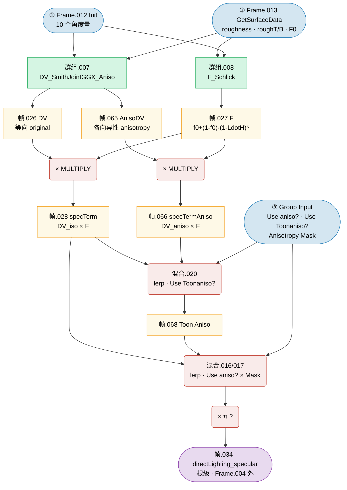

# 🔬 Frame.004 — SpecularBRDF 详细分析

> 溯源：`docs/raw_data/PBRToonBase_full_20260227.json`
> 提取日期：2026-03-04
> 相关文件：`hlsl/PBRToonBase.hlsl`（Frame.004 段）、`hlsl/SubGroups/SubGroups.hlsl`
> 上级架构：`docs/analysis/Materials/M_actor_pelica_cloth_04/01_shader_arch.md`

---

## 📋 模块概述

| 指标 | 值 |
|------|-----|
| 父框 | `Frame.004` |
| 总节点数 | 19（含 6 个 FRAME 子框、4 个 GROUP_INPUT、1 个 REROUTE） |
| 逻辑节点 | 12 |
| 子框（帧） | 帧.026(DV)、帧.027(F)、帧.028(specTerm)、帧.065(AnisoDV)、帧.066(specTermAniso)、帧.068(Toon Aniso) |
| 子群组调用 | `DV_SmithJointGGX_Aniso`（群组.007）、`F_Schlick`（群组.008） |
| 运算节点 | `VECT_MATH` ×3（Vector Math.003 / .016 / .018）、`MIX` ×3（混合.016 / .017 / .020） |

**职责**：计算各向异性 Smith-GGX 高光 BRDF，输出直接光镜面反射项（`directLighting_specular`）。

---

## 🗂️ 节点清单

| 节点名 | 类型 | 标签/功能 | 所属子框 |
|--------|------|-----------|---------|
| `群组.007` | GROUP | `DV_SmithJointGGX_Aniso` | — |
| `群组.008` | GROUP | `F_Schlick` | — |
| `帧.026` | FRAME | DV | — |
| `帧.027` | FRAME | F | — |
| `帧.028` | FRAME | specTerm | — |
| `帧.065` | FRAME | AnisoDV | — |
| `帧.066` | FRAME | specTermAniso | — |
| `帧.068` | FRAME | Toon Aniso | — |
| `Vector Math.003` | VECT_MATH | DV_iso × F（等向 specTerm） | 帧.028 内 |
| `Vector Math.018` | VECT_MATH | DV_aniso × F（各向异性 specTerm） | 帧.066 内 |
| `Vector Math.016` | VECT_MATH | 可能为 ×π 归一化修正 | — |
| `混合.016` | MIX | Use anisotropy? 选择 | — |
| `混合.017` | MIX | Anisotropy Mask 加权 | — |
| `混合.020` | MIX | Use Toonaniso? 选择 | 帧.068 内 |
| `Group Input.001` | GROUP_INPUT | Use anisotropy? | — |
| `Group Input.002` | GROUP_INPUT | Use Toonaniso? | — |
| `Group Input.033` | GROUP_INPUT | 粗糙度/遮罩参数 | — |
| `Group Input.046` | GROUP_INPUT | 粗糙度/遮罩参数 | — |
| `Reroute.026` | REROUTE | 连线中继 | — |

---

## 📥 外部输入来源

| 输入变量 | 来源 Frame | 来源子框/节点 |
|---------|-----------|------------|
| `NdotH` | Frame.012 Init | 框.023/024/025 `Get_NoH_LoH_ToH_BoH` 输出 |
| `LdotH` | Frame.012 Init | 框.023/024/025 `Get_NoH_LoH_ToH_BoH` 输出 |
| `TdotH` | Frame.012 Init | 框.023/024/025 |
| `BdotH` | Frame.012 Init | 框.023/024/025 |
| `TdotL / BdotL` | Frame.012 Init | 框.056/057 `VECT_MATH.DOT` |
| `TdotV / BdotV` | Frame.012 Init | 框.058/059 `VECT_MATH.DOT` |
| `Abs_NdotL` | Frame.012 Init | `NoL_Unsaturate`（取绝对值） |
| `clampedNdotV` | Frame.012 Init | 框.005 `ClampNdotV` |
| `roughness` | Frame.013 GetSurfaceData | 框.011 物理粗糙度 |
| `roughnessT` | Frame.013 GetSurfaceData | 框.060/061 切线方向各向异性粗糙度 |
| `roughnessB` | Frame.013 GetSurfaceData | 框.062/063/064 副切线方向各向异性粗糙度 |
| `fresnel0` (F0) | Frame.013 GetSurfaceData | 框.013 `ComputeFresnel0` 输出 |
| `Use anisotropy?` | Group Input.001 | 各向异性总开关（bool） |
| `Use Toonaniso?` | Group Input.002 | Toon 各向异性风格开关（bool） |
| 其他参数 | Group Input.033 / .046 | 粗糙度修正 / Anisotropy Mask |

---

## 📊 计算流程



**图注**

| 编号 | 来源 Frame | 传入变量 |
|:----:|-----------|---------|
| ① | Frame.012 Init | `NdotH` `LdotH` `TdotH` `BdotH` `TdotL` `BdotL` `TdotV` `BdotV` `Abs_NdotL` `clampedNdotV` |
| ② | Frame.013 GetSurfaceData | `roughness` `roughnessT` `roughnessB` `fresnel0` |
| ③ | Group Input | `Use anisotropy?` `Use Toonaniso?` `Anisotropy Mask` |

---

## 📦 子框功能说明

| 子框 | 标签 | 内含节点 | 语义 |
|------|------|---------|------|
| `帧.026` | **DV** | `转接点.028 (REROUTE)` | 等向性 DV 项中继缓存 |
| `帧.027` | **F** | `转接点.034 (REROUTE)` | Schlick Fresnel 项中继缓存 |
| `帧.028` | **specTerm** | `转接点.035 (REROUTE)` + `Vector Math.003` | 等向高光项：`DV_iso × F` |
| `帧.065` | **AnisoDV** | `转接点.133 (REROUTE)` | 各向异性 DV 项中继缓存 |
| `帧.066` | **specTermAniso** | `转接点.134 (REROUTE)` + `Vector Math.018` | 各向异性高光项：`DV_aniso × F` |
| `帧.068` | **Toon Aniso** | `转接点.136 (REROUTE)` + `混合.020` | Toon 各向异性选择输出 |

---

## 📌 双路并行结构设计

Frame.004 的核心设计是**两路 DV 并行 + 两次 bool flag 选择**：

```
路径 A（各向同性）:   roughness          → DV_iso    → specTerm
路径 B（各向异性）:   roughT / roughB    → DV_aniso  → specTermAniso

F 项（Fresnel）：共用同一个 F_Schlick 输出，同时送入两路乘法
```

### 📌 Flag 组合矩阵

| Use Toonaniso? | Use anisotropy? | 最终行为 |
|:--------------:|:---------------:|---------|
| False | False | 纯各向同性 GGX（标准 PBR） |
| False | True | Anisotropy Mask 加权混合（等向 ↔ 各向异性） |
| True | False | Toon 各向异性风格（无遮罩混合） |
| True | True | Toon 各向异性 + Mask 加权（Toon + PBR 混合） |

---

## 💻 HLSL 等价（完整）

```cpp
// Frame.004 — SpecularBRDF
// 溯源: PBRToonBase_full_20260227.json → Frame.004 (群组.007 / 群组.008)

// ── Step 1: DV 项（群组.007 DV_SmithJointGGX_Aniso） ────────────────────

// 等向分支内部 [帧.026 DV]
// a2 = roughness²（群组.007 内 运算 MULTIPLY，clampedRoughness 自乘）
float a2 = roughness * roughness;

// partLambdaV：无 sqrt，返回 sqrt 内部的值
//   (1-a2)*NdotV² + a2  ← GetSmithJointGGetSmithJointGGXPartLambdaV
float partLambdaV = (1.0 - a2) * clampedNdotV * clampedNdotV + a2;

// lambdaV_iso = Abs_NdotL × partLambdaV（群组.007 内 运算.005 MULTIPLY）
float lambdaV_iso = Abs_NdotL * partLambdaV;

// 等向 D×V（DV_SmithJointGGX.IN，群组.001）
float DV_iso = DV_SmithJointGGX_IN(lambdaV_iso, NdotH, Abs_NdotL, clampedNdotV, a2);

// 各向异性分支内部 [帧.065 AnisoDV]
// AnisoPartLambdaV = ||(roughT*TdotV, roughB*BdotV, NdotV)||
//   ← GetSmithJointGGXAnisoPartLambdaV（群组.002）
float AnisoPartLambdaV = length(float3(roughnessT * TdotV, roughnessB * BdotV, clampedNdotV));

// 各向异性 D×V（DV_SmithJointGGXAniso，群组.003）
float DV_aniso = DV_SmithJointGGXAniso_Full(
    NdotH, roughnessT, roughnessB,
    TdotH, BdotH, AnisoPartLambdaV,
    Abs_NdotL, clampedNdotV, TdotL, BdotL);

// ── Step 2: F 项 — Schlick Fresnel（群组.008 F_Schlick）[帧.027] ────────
float3 F = F_Schlick(fresnel0, float3(1.0, 1.0, 1.0), LdotH);
// F = fresnel0 + (1 - fresnel0) * (1 - LdotH)^5

// ── Step 3: 两路高光项 ────────────────────────────────────────────────────
float3 specTerm      = F * DV_iso;    // Vector Math.003  [帧.028]
float3 specTermAniso = F * DV_aniso;  // Vector Math.018  [帧.066]

// ── Step 4: Toon Aniso 选择（混合.020）[帧.068] ───────────────────────────
float3 toonAnisoResult = UseToonAniso ? specTermAniso : specTerm;

// ── Step 5: Use anisotropy? 最终混合（混合.016 / 混合.017） ────────────────
float3 finalSpecTerm;
if (UseAnisotropy)
    finalSpecTerm = lerp(specTerm, toonAnisoResult, AnisotropicMask);
else
    finalSpecTerm = specTerm;

// ── Step 6: π 归一化修正（Vector Math.016，待确认） ──────────────────────
// finalSpecTerm *= PI;

// → 输出 directLighting_specular [帧.034]（根级，Frame.004 外）
float3 directLighting_specular = finalSpecTerm * LightColor * LightIntensity;
```

---

## 🔗 子群组参考

Frame.004 的直接子群组为 L2 层节点；L2 内部实现已独立归档，本文档不重复展开。

| 群组 | 层级 | 节点数 | 职责摘要 | 详细文档 |
|-----|-----|:---:|---------|---------|
| `DV_SmithJointGGX_Aniso` | L2 | 22 | 等向/各向异性 D×V 并行计算，输出 `original`（等向）和 `anisotropy`（各向异性） | [DV_SmithJointGGX_Aniso.md](../sub_groups/DV_SmithJointGGX_Aniso.md) |
| `F_Schlick` | L2 | 19 | Schlick Fresnel：`f0 + (f90−f0)×(1−LdotH)⁵`，`f90` 推测为 `(1,1,1)` | [F_Schlick.md](../sub_groups/F_Schlick.md) |
| `GetSmithJointGGXPartLambdaV` | L3 | 9 | `NdotV²·(1−a2)+a2`，**无 sqrt**（近似形式，与 HDRP 标准版差异见备注） | [DV_SmithJointGGX_Aniso_L3.md](../sub_groups/DV_SmithJointGGX_Aniso_L3.md) |
| `DV_SmithJointGGX.IN` | L3 | 35 | 等向 GGX D×V 最终合并（lambdaL **含 sqrt**，lambdaV 无 sqrt，5 框） | [DV_SmithJointGGX_Aniso_L3.md](../sub_groups/DV_SmithJointGGX_Aniso_L3.md) |
| `GetSmithJointGGXAnisoPartLambdaV` | L3 | 6 | `length(αT·TdotV, αB·BdotV, NdotV)`，各向异性 ΛV 预计算 | [DV_SmithJointGGX_Aniso_L3.md](../sub_groups/DV_SmithJointGGX_Aniso_L3.md) |
| `DV_SmithJointGGXAniso` | L3 | 44 | 各向异性 GGX D×V，含 a2_Aniso / lambdaV / lambdaL / s / D / G / V 七框 | [DV_SmithJointGGX_Aniso_L3.md](../sub_groups/DV_SmithJointGGX_Aniso_L3.md) |

> L3 节点均为叶节点（无第四层子群组），Blender 提取日期：2026-03-04。

---

## 🔗 子群组调用树

```
Frame.004 SpecularBRDF
├── 群组.007  DV_SmithJointGGX_Aniso          ← L2（详见 DV_SmithJointGGX_Aniso.md）
│   ├── GetSmithJointGGetSmithJointGGXPartLambdaV  ╮
│   ├── DV_SmithJointGGX.IN                        │ L3 叶节点
│   ├── GetSmithJointGGXAnisoPartLambdaV           │ 详见 DV_SmithJointGGX_Aniso_L3.md
│   └── DV_SmithJointGGXAniso                      ╯
└── 群组.008  F_Schlick                        ← L2 叶节点（详见 F_Schlick.md）
```

> **调用深度**：Frame.004 → L2（2个）→ L3（4个，均为叶节点，无第四层）
> **名称 typo**：`GetSmithJointGGetSmithJointGGXPartLambdaV` 为 Blender 原始群组名（"G" 重复），迁移 HLSL 时应改为规范名 `GetSmithJointGGXPartLambdaV`。

---

## ⚙️ laevat_cloth_05 特化参数

Frame.013 中计算的各向异性粗糙度参数（通过 `AnisotropicRoughnessMaxT/B` 控制）：

| 参数 | 值 | 说明 |
|------|----|------|
| `roughnessT` (MaxT) | **0.22** | 切线方向最大粗糙度（高光在 T 轴方向较锐） |
| `roughnessB` (MaxB) | **0.67** | 副切线方向最大粗糙度（高光在 B 轴方向较宽） |

T/B 差异为 3 倍（0.22 vs 0.67），产生**沿布料丝纹方向的拉长高光**，是丝绸/缎面布料的典型各向异性 BRDF 表现。

---

## 📌 与其他 Frame 的边界

| 边界方向 | Frame | 传递的变量 |
|---------|-------|-----------|
| **接收** | Frame.012 Init | 10 个角度量（NdotH、LdotH、TdotH/BdotH、TdotL/BdotL、TdotV/BdotV、Abs_NdotL、clampedNdotV） |
| **接收** | Frame.013 GetSurfaceData | 4 个表面参数（roughness、roughnessT/B、fresnel0） |
| **输出** | 帧.034（根级）→ 下游汇合 | `directLighting_specular`（直接光高光项） |
| **输出** | Frame.006 IndirectLighting | `specTerm`（用于 ecFactor 能量守恒修正） |

---

## 💡 设计要点

| 要点 | 说明 |
|------|------|
| F 项共用 | F_Schlick 只调用一次，等向/各向异性两路共用同一 F 项 |
| lambdaV 无 sqrt | `GetSmithJointGGetSmithJointGGXPartLambdaV` 返回 sqrt 内部值（近似形式），lambdaL 有 sqrt；不完全对称 |
| 各向异性 lambda | `GetSmithJointGGXAnisoPartLambdaV` 直接返回 `length(...)` 无需 sqrt（LENGTH 自带） |
| 两级 flag | `Use Toonaniso?` 先选 Toon 分支，`Use anisotropy?` 再控制 Mask 混合 |
| 帧.034 在 Frame.004 外 | `directLighting_specular` 帧是根级节点，高光与光色最终合并在 Frame.004 之外进行 |
| Blender 名称 typo | `GetSmithJointGGetSmithJointGGXPartLambdaV`（"G" 重复），迁移时改为规范名 |

---

## 🎮 Unity URP 迁移要点

| 要点 | Unity URP 处理 |
|------|---------------|
| `DV_SmithJointGGX_Aniso` | 参考 HDRP `Packages/com.unity.render-pipelines.high-definition/Runtime/Lighting/LightLoop/BSDF.hlsl` |
| `GetSmithJointGGXPartLambdaV` | 注意无 sqrt（Blender 实现与 HDRP 不同），使用 `(1-a2)*NdotV²+a2` |
| `GetSmithJointGGXAnisoPartLambdaV` | 直接 `length(roughT*TdotV, roughB*BdotV, NdotV)` |
| `DV_SmithJointGGXAniso` | 同 HDRP `D_GGXAniso × V_SmithJointGGXAniso` |
| `F_Schlick` | `FresnelTerm(specColor, lh)` 或手动实现 |
| 各向异性 roughT/B | URP 无内置各向异性 GGX；需自行在 Fragment Shader 实现 |
| `Use anisotropy?` flag | 改为 `#pragma shader_feature ANISOTROPY_ON` |
| `Use Toonaniso?` flag | 改为 `#pragma shader_feature TOON_ANISO_ON` |
| `Vector Math.016`（待确认 ×π） | 若是 π 修正，Unity 侧必须保持一致 |
| `directLighting_specular`（帧.034 根级） | 在主 shader 的 light loop 中乘以 `mainLight.color × mainLight.distanceAttenuation` |

---

## ❓ 待确认

- [ ] `Vector Math.016` 的实际运算类型（是否为 MULTIPLY × PI？）
- [ ] `混合.017` 的具体用途（Anisotropy Mask 混合，还是 directLighting 与 AO 的叠加？）
- [ ] `Group Input.033 / .046` 对应的具体参数名称（粗糙度修正还是各向异性 Mask？）
- ✅ ~~第三层子群组的完整实现~~ ← 已分析（2026-03-04）
- [ ] `DV_SmithJointGGX.IN` 中 lambdaV 路径是否有隐含 sqrt（现有节点数据不包含 sqrt，与 lambdaL 不对称）
