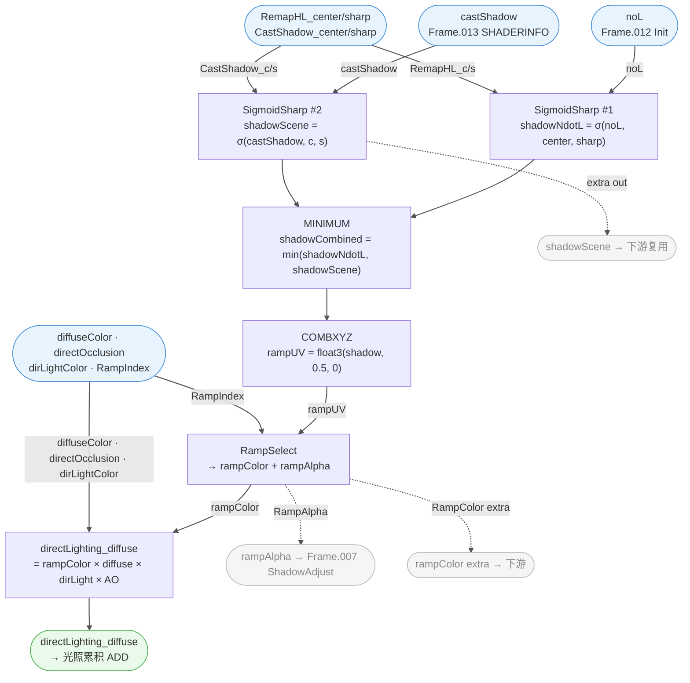

# 🔬 Frame.005 — DiffuseBRDF 详细分析

> 溯源：`docs/raw_data/PBRToonBase_full_20260227.json`
> 提取日期：2026-03-04（Blender MCP 实时验证）
> 相关文件：`hlsl/PBRToonBase.hlsl`（Frame.005 段）、`hlsl/SubGroups/SubGroups.hlsl`
> 上级架构：`docs/analysis/Materials/M_actor_pelica_cloth_04/01_shader_arch.md`

---

## 📋 模块概述

| 指标 | 值 |
|------|-----|
| Frame 节点名 | `Frame.005`（英文名） |
| 模块标签 | **DiffuseBRDF** |
| 总节点数 | 19（含 4 FRAME 子框 + 4 GROUP_INPUT + 4 REROUTE + 2 内置 + 4 GROUP + 1 COMBXYZ） |
| 逻辑节点 | 7（SigmoidSharp×2 / MINIMUM / COMBXYZ / RampSelect / directLighting_diffuse） |
| 子群组调用 | 4 调用（3 个唯一：`SigmoidSharp` ×2、`RampSelect` ×1、`directLighting_diffuse` ×1） |
| 子框（帧） | `帧.015` `帧.018` `帧.019` `帧.032`（共 4 个） |

**职责**：计算 Toon 风格直接光漫反射。将 halfLambert + 场景投影阴影双路软化、取暗合并，通过 Toon Ramp 映射为阴影色带颜色，最终乘以漫反射基础色、光色与 AO，输出直接光漫反射项。

> **命名勘误**：Blender 中文 locale 将 FRAME 节点命名为 `帧.xxx`，顶级模块使用英文名 `Frame.005`（混用）。`帧.005`（中文）= `ClampNdotV`（Frame.012 内部子框），与 `Frame.005 DiffuseBRDF` 完全不同，原 shader_arch.md 已混淆此点。

---

## 🗂️ 节点清单

| 节点名 | 类型 | 子框 | 作用 |
|--------|------|------|------|
| `群组.004` | GROUP `SigmoidSharp` | 直接 Frame.005 | halfLambert 阴影边缘过渡 |
| `群组.006` | GROUP `SigmoidSharp` | 直接 Frame.005 | 场景投影阴影边缘软化 |
| `运算.002` | MATH `MINIMUM` | 直接 Frame.005 | 两路阴影取暗合并 |
| `合并 XYZ` | COMBXYZ | 直接 Frame.005 | 打包 (shadow, 0.5, 0) → RampUV Vector |
| `群组.011` | GROUP `RampSelect` | 直接 Frame.005 | Toon Ramp 贴图采样 |
| `群组.019` | GROUP `directLighting_diffuse` | 直接 Frame.005 | 漫反射四路乘积输出 |
| `Group Input.009` | GROUP_INPUT | 直接 Frame.005 | 提供 `RampIndex` |
| `Group Input.026` | GROUP_INPUT | 直接 Frame.005 | 提供 `RemaphalfLambert_center` |
| `Group Input.027` | GROUP_INPUT | 直接 Frame.005 | 提供 `RemaphalfLambert_sharp` |
| `Group Input.028` | GROUP_INPUT | 直接 Frame.005 | 提供 `CastShadow_center` |
| `Group Input.029` | GROUP_INPUT | 直接 Frame.005 | 提供 `CastShadow_sharp` |
| `帧.015` | FRAME `shadowNdotL` | — | SigmoidSharp#1 输出子框 |
| `帧.018` | FRAME `shadowArea` | — | COMBXYZ 输出子框（RampUV Vector） |
| `帧.019` | FRAME `shadowScene` | — | SigmoidSharp#2 输出子框 |
| `帧.032` | FRAME `shadowRampColor` | — | RampColor 输出子框 |
| `转接点.014` | REROUTE (VALUE) | `帧.015` | SigmoidSharp#1 输出缓存 |
| `转接点.015` | REROUTE (VECTOR) | `帧.018` | COMBXYZ 输出缓存（RampUV） |
| `转接点.016` | REROUTE (VALUE) | `帧.019` | SigmoidSharp#2 输出缓存 |
| `转接点.050` | REROUTE (RGBA) | `帧.032` | RampColor 输出缓存 |

---

## 📥 外部输入来源

| 输入变量 | 来源 Frame | 来源节点 | 含义 |
|---------|-----------|---------|------|
| `noL` | Frame.012 Init | `运算.001`（MATH） | dot(N,L) 相关，halfLambert 输入 |
| `castShadow` | Frame.013 GetSurfaceData | `Shader Info.Cast Shadows`（SHADERINFO） | 引擎投影阴影掩码 (0~1) |
| `directOcclusion` | Frame.013 GetSurfaceData | `混合.005.Result`（MIX） | _P.G × directOcclusionColor 合成 |
| `diffuseColor` | Frame.013 GetSurfaceData | `群组.009.输出`（ComputeDiffuseColor） | 漫反射基础色 |
| `dirLightColor` | Group Input | `Group Input.057.dirLight_lightColor` | 平行光颜色（含强度） |
| `RemaphalfLambert_center/sharp` | Group Input | `Group Input.026/027` | halfLambert SigmoidSharp 参数 |
| `CastShadow_center/sharp` | Group Input | `Group Input.028/029` | CastShadow SigmoidSharp 参数 |
| `RampIndex` | Group Input | `Group Input.009.RampIndex` | Toon Ramp 行索引 (0~4) |

> `SHADERINFO` 节点物理位置在 Frame.013 内，但其 `Cast Shadows` 输出穿越到 Frame.005，说明引擎阴影信息在表面数据帧内统一获取后分发。

---

## 📤 外部输出

| Frame 内节点 | Socket | 目标节点/Frame | 语义 |
|--------------|--------|----------------|------|
| `群组.019` | `directLighting_diffuse` | 根级 `转接点.059` → `Vector Math.015` (ADD) | 与 Specular 合并，进入完整光照汇总 |
| `群组.011` | `RampAlpha` | `群组.012` (Frame.007 ShadowAdjust, SmoothStep) `.x` | 驱动全局阴影亮度调整 |
| `转接点.050` | `Output`（RampColor） | `Reroute.016`（→ 下游） | RampColor 额外输出（推测至 DeSaturation 路径） |
| `转接点.016` | `Output`（shadowScene Float） | `Reroute.098`（→ 下游） | 投影阴影值额外输出（推测至阴影相关模块） |

---

## 📊 计算流程



---

## 🔍 关键设计解析

### 双路 SigmoidSharp → MINIMUM

Frame.005 核心：**两种阴影独立软化，取最暗值合并**。

| 路径 | 输入信号 | 参数 | 语义 |
|------|---------|------|------|
| halfLambert | `NoL`（dot(N,L)） | `RemaphalfLambert_center/sharp` | 法线-光夹角产生的漫反射阴影 |
| CastShadow | `SHADERINFO.Cast Shadows` | `CastShadow_center/sharp` | 引擎投影阴影（物体间遮挡） |

```
shadowCombined = min(
    SigmoidSharp(noL,         RemapHL_center, RemapHL_sharp),
    SigmoidSharp(castShadow,  CS_center,      CS_sharp)
)
```

SigmoidSharp 底数为 100000（非自然常数 e），`sharp↑` → 更硬的卡通阴影分界。MINIMUM 保证投影阴影能完全覆盖自阴影。

### COMBXYZ → RampUV (Vector)

```hlsl
float3 rampUV = float3(shadowCombined, 0.5, 0.0);
```

RampSelect 接收 `VECTOR` 类型（非 float）。X = 阴影值（Ramp U 轴），Y = 0.5（固定 V 轴，在 1D Ramp 贴图中采样中线），Z = 0。COMBXYZ 充当"float → RampUV Vector"类型适配器。

### `directLighting_diffuse.矢量` = `dirLight_lightColor`

之前 directLighting_diffuse.md 中 `矢量` 插槽含义存疑，现已通过 Blender MCP 确认：

> **`矢量` = `Group Input.dirLight_lightColor`（平行光颜色 RGBA Vector）**，非方向向量。

最终漫反射公式：
```
directDiffuse = shadowRampColor × diffuseColor × dirLightColor × directOcclusion
```

---

## 🔗 子群组

| 子群组 | 节点名 | 文档状态 | 职责摘要 |
|--------|--------|----------|---------|
| `SigmoidSharp` | `群组.004` | ✅ 已有文档 | `1/(1+pow(100000, -3·sharp·(x-center)))`，halfLambert 路径 |
| `SigmoidSharp` | `群组.006` | ✅ 已有文档 | 同上，CastShadow 路径，参数独立 |
| `RampSelect` | `群组.011` | ✅ 已有文档 | 5 条 Ramp LUT 选择采样，输出 RampColor + RampAlpha |
| `directLighting_diffuse` | `群组.019` | ✅ 已有文档 | `shadowRampColor × diffuse × dirLight × AO` |

> 所有子群组均已独立归档，详见 [sub_groups/](../sub_groups/)。

---

## 💻 HLSL 等价（完整）

```hlsl
// =============================================================================
// Frame.005 — DiffuseBRDF
// 群组：Arknights: Endfield_PBRToonBase  |  溯源：PBRToonBase_full_20260227.json
// 节点：19（SigmoidSharp×2 / MINIMUM / COMBXYZ / RampSelect / directLighting_diffuse）
// =============================================================================

// --- 入参（来自外部 Frame 或群组接口）---
// noL                     : float   ← Frame.012 Init / 运算.001 (NoL 相关 MATH)
// castShadow              : float   ← Frame.013 GetSurfaceData / SHADERINFO.Cast Shadows
// directOcclusion         : float3  ← Frame.013 GetSurfaceData / 混合.005.Result
// diffuseColor            : float3  ← Frame.013 GetSurfaceData / ComputeDiffuseColor.输出
// dirLightColor           : float3  ← Group Input.dirLight_lightColor（平行光颜色）
// RemapHalfLambert_center : float   ← Group Input
// RemapHalfLambert_sharp  : float   ← Group Input
// CastShadow_center       : float   ← Group Input
// CastShadow_sharp        : float   ← Group Input
// RampIndex               : float   ← Group Input (0~4，选择 5 条 Ramp 之一)

void Frame_005_DiffuseBRDF(
    float  noL,
    float  castShadow,
    float3 directOcclusion,
    float3 diffuseColor,
    float3 dirLightColor,
    float  RemapHalfLambert_center,
    float  RemapHalfLambert_sharp,
    float  CastShadow_center,
    float  CastShadow_sharp,
    float  RampIndex,
    out float3 outDirectDiffuse,   // → 根级 Vector Math.015（ADD with Specular & IndirectSpec）
    out float  outRampAlpha        // → Frame.007 ShadowAdjust / SmoothStep.x
)
{
    // ── Step 1: 帧.015 shadowNdotL ── SigmoidSharp #1（halfLambert 阴影） ─────────
    // 群组.004  inputs: x=noL, center=RemapHL_center, sharp=RemapHL_sharp
    // t = -3 * sharp * (noL - center)
    // output = 1 / (1 + pow(100000, t))
    float shadowNdotL = SigmoidSharp(noL,
                                     RemapHalfLambert_center,
                                     RemapHalfLambert_sharp);

    // ── Step 2: 帧.019 shadowScene ── SigmoidSharp #2（投影阴影软化） ─────────────
    // 群组.006  inputs: x=castShadow, center=CS_center, sharp=CS_sharp
    float shadowScene = SigmoidSharp(castShadow,
                                     CastShadow_center,
                                     CastShadow_sharp);

    // ── Step 3: 运算.002 MINIMUM ── 双路阴影取暗合并 ────────────────────────────
    // 投影阴影能完全覆盖自阴影（取最暗值）
    float shadowCombined = min(shadowNdotL, shadowScene);

    // ── Step 4: 合并 XYZ ── 打包为 RampUV Vector ────────────────────────────────
    // 帧.018 shadowArea
    // X = 阴影值（Ramp U 轴，0=受光/亮，1=背光/暗）
    // Y = 0.5（固定 V 轴，在 1D Ramp 贴图中采样中线像素）
    // Z = 0.0（无效）
    float3 rampUV = float3(shadowCombined, 0.5, 0.0);

    // ── Step 5: 帧.032 shadowRampColor ── RampSelect Toon Ramp 采样 ──────────────
    // 群组.011  inputs: RampUV=rampUV(Vector), RampIndex=RampIndex
    // 内部：从 5 条 Ramp LUT 中按 RampIndex 选取，以 rampUV.x 为 U 坐标采样
    // Unity 建议：5 条 1D Ramp 合并为 5×N 2D LUT，RampIndex/4 作 V 坐标
    float3 rampColor;
    float  rampAlpha;
    RampSelect(rampUV, RampIndex, /*out*/ rampColor, /*out*/ rampAlpha);

    // ── Step 6: 群组.019 directLighting_diffuse ── 漫反射四路乘积 ────────────────
    // shadowRampColor × diffuseColor × dirLightColor × directOcclusion
    float3 directDiffuse = DirectLightingDiffuse(
        rampColor,        // shadowRampColor（Ramp 阴影色，亮部→暗部颜色过渡）
        directOcclusion,  // 混合.005.Result（AO 叠加色，含 directOcclusionColor）
        diffuseColor,     // ComputeDiffuseColor.输出
        dirLightColor     // Group Input.dirLight_lightColor（平行光颜色 Vector）
    );

    outDirectDiffuse = directDiffuse; // → Vector Math.015（ADD with Specular & IndirectSpec）
    outRampAlpha     = rampAlpha;     // → Frame.007 SmoothStep.x（全局阴影亮度调整）
                                      // 同时向 Reroute.098 额外输出（→ DeSaturation 路径推测）
}
```

---

## 📌 与其他 Frame 的边界

| 边界方向 | Frame | 传递变量 |
|---------|-------|---------|
| **接收** | Frame.012 Init | `NoL`（运算.001 MATH 输出，NoL 相关计算） |
| **接收** | Frame.013 GetSurfaceData | `SHADERINFO.Cast Shadows`（引擎投影阴影 0~1） |
| **接收** | Frame.013 GetSurfaceData | `directOcclusion`（混合.005.Result，AO 叠色） |
| **接收** | Frame.013 GetSurfaceData | `diffuseColor`（ComputeDiffuseColor.输出） |
| **接收** | Group Input | `dirLight_lightColor` `RemapHL_c/s` `CS_c/s` `RampIndex` |
| **输出** | 根级 Vector Math.015 | `directLighting_diffuse`（与 Specular / IndirectSpec 合并） |
| **输出** | Frame.007 ShadowAdjust | `RampAlpha`（→ SmoothStep.x，全局阴影亮度下限） |
| **输出** | 推测 帧.071 DeSaturation 路径 | `shadowScene`（Reroute.098）/ `RampColor`（Reroute.016） |

---

## ⚙️ 原 shader_arch.md 勘误

| 项目 | 原文（01_shader_arch.md） | 实际（Blender MCP 验证） |
|------|--------------------------|------------------------|
| 子框 帧.014 | "RemaphalfLambert 在 Frame.005 内" | `帧.014 RemaphalfLambert` 不在 Frame.005 内；Frame.005 内实际有 `帧.015 shadowNdotL` |
| 子框 帧.033 | "directLighting_diffuse 在 Frame.005 内" | `帧.033` 在根级；Frame.005 内是 `群组.019`（GROUP 节点） |
| 帧.018 语义 | 含糊描述 | `帧.018 shadowArea` = COMBXYZ 输出（RampUV Vector），是合并后的 UV，非原始投影阴影值 |
| RampUV 类型 | 暗示为 Float | 实际为 **VECTOR** 类型（X=shadow, Y=0.5 固定） |
| `矢量` 插槽 | "待确认" | 已确认 = `dirLight_lightColor`（Group Input，平行光颜色） |
| 节点数 | "11 个逻辑节点" | 实际 19 节点总数（含 FRAME/GROUP_INPUT/REROUTE） |

---

## 🎮 Unity URP 迁移要点

| 要点 | Unity URP 处理 |
|------|---------------|
| 双路 SigmoidSharp | `_RemapHalfLambert_center/sharp` `_CastShadow_center/sharp` 四个独立参数 |
| CastShadow 来源 | `mainLight.shadowAttenuation`（需 Shadow Caster Pass） |
| MINIMUM 合并 | `min(shadowNdotL, shadowScene)` 直接对应 |
| RampUV = Vector | `SAMPLE_TEXTURE2D(_RampLUT, sampler_RampLUT, float2(shadowCombined, 0.5))` |
| RampSelect 5 张贴图 | 合并为 5×N 2D LUT，`(RampIndex + 0.5) / 5.0` 作 V 坐标（见 RampSelect.md） |
| `dirLightColor` | `mainLight.color`（Goo Engine 含强度，Unity 需手动乘 `mainLight.distanceAttenuation`） |
| `directOcclusion` | `_P.G` 与 `_DirectOcclusionColor` MIX 结果，非纯 float AO |
| RampAlpha 双用 | 同时驱动 `ShadowAdjust`（亮度下限）+ `DeSaturation`（阴影区去饱和） |

---

## ❓ 待确认

- [ ] `运算.001 (Frame.012)` 的具体运算类型（MATH 操作是 ABS / MULTIPLY / 其他？影响 NoL 的预处理方式）
- [ ] `转接点.016 → Reroute.098` 的最终下游（shadowScene float 第二用途）
- [ ] `转接点.050 → Reroute.016` 的最终下游（RampColor 第二用途，推测至 帧.071 HSV DeSaturation）
- [ ] `混合.005 (Frame.013).Result` 的具体计算（directOcclusion 的 MIX 操作内容）
