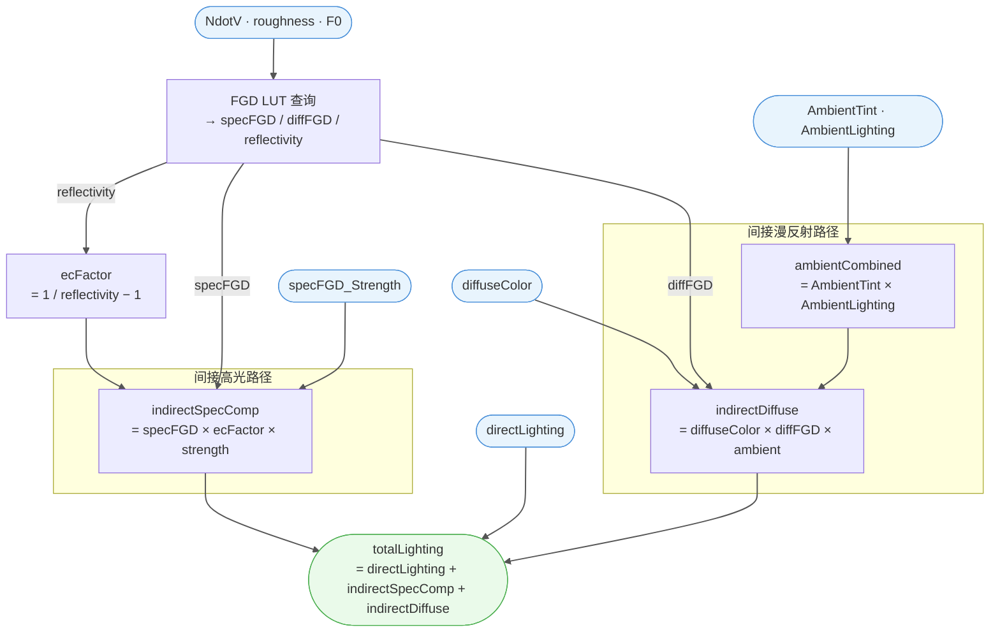

# 🔬 Frame.006 — IndirectLighting 详细分析

> 溯源：`docs/raw_data/PBRToonBase_full_20260227.json`
> 提取日期：2026-02-27
> 相关文件：`hlsl/PBRToonBase.hlsl`（Frame.006 段）、`hlsl/SubGroups/SubGroups.hlsl`
> 上级架构：`docs/analysis/Materials/M_actor_pelica_cloth_04/01_shader_arch.md`

---

## 📋 模块概述

| 指标 | 值 |
|------|-----|
| Frame 节点名 | `Frame.006`（英文名） |
| 模块标签 | **IndirectLighting** |
| 总节点数 | ~24（含 4 FRAME 子框 + 2 GROUP_INPUT + ~5 REROUTE + 12 逻辑节点） |
| 逻辑节点 | 12（GROUP×1 / MATH×2 / VECT_MATH×2 / MIX×7） |
| 子框（帧） | `帧.035`（energyCompensation）· `帧.036`（ambientCombined）· `帧.037`（diffuseFGD）· `帧.038`（specularFGD） |
| 子群组调用 | `GetPreIntegratedFGDGGXAndDisneyDiffuse`（群组.005）× 1 |
| 运算节点 | `MATH` ×2、`VECT_MATH` ×2、`MIX` ×7 |

**职责**：查询预积分 FGD LUT，计算能量守恒修正因子（ecFactor），将间接镜面能量补偿与间接漫反射合并到直接光照结果，输出完整的直接+间接光照累积值。

---

## 📖 理论背景

### 1. 渲染方程的直接/间接拆分

实时渲染中，出射辐射度通常拆分为两项分别求解：

```
Lo(v) = Lo_direct(v) + Lo_indirect(v)
```

- **直接光照**（Frame.004/005）：对场景中每盏灯逐一积分，以解析解近似。
- **间接光照**（本 Frame）：来自环境、多次弹射的光——实时中通过预计算 LUT、球谐或环境探针来近似。

Frame.006 的职责正是计算 `Lo_indirect` 并叠加到 `directLighting` 上，组成完整的渲染方程输出。

---

### 2. Split-Sum 近似与预积分 FGD LUT

**问题**：反射方程 `∫ f_r(l,v) Li(l) (N·L) dΩ` 含两个未知量 `Li`（光照）与 `f_r`（BRDF），无法拆分解析求解。

**Karis 2013（UE4 Split-Sum）** 将积分近似分解为：

```
∫ f_r(l,v) Li(l) (N·L) dΩ  ≈  [ ∫ Li(l) dΩ_lod ]  ×  [ ∫ f_r(l,v) (N·L) dΩ ]
        ↑ 环境辐射（卷积cubemap）         ↑ FGD 预积分（只依赖 NdotV、roughness、F0）
```

**FGD 预积分**将 BRDF 积分预先烘焙到一张 2D LUT（NdotV × roughness）中：

```
FGD(NdotV, α) = ∫ f_GGX(l,v) / F(v,h)  (N·L) dΩ
             = F0 · A(NdotV,α) + B(NdotV,α)      ← 经典 HDRP 双通道拆分
```

| LUT 通道 | 含义 | 本 shader 映射 |
|---------|------|--------------|
| R | `B_term`（F0=0 积分项） | LUT.R |
| G | `A_term + B_term`（总反射率 `r`） | LUT.G → `reflectivity` |
| B | Disney Diffuse FGD | LUT.B → `diffuseFGD` |
| `specularFGD` | `F0·A + B`（per-channel lerp） | 群组.005 输出 |

> **注意**：本 LUT 的 R/G 通道定义与 HDRP 标准互换（HDRP: R=A_term, G=B_term），迁移时须对应调整。

---

### 3. 多重散射能量补偿（Kulla-Conty 近似）

**问题**：单次散射 GGX 模型存在能量损失——当粗糙度较高时，应被遮蔽光线在微面元之间的**多次弹射**贡献被忽略，导致材质整体偏暗（违反能量守恒）。

**Kulla & Conty 2017** 提出用补偿项 `F_ms` 追加这部分损失的能量：

```
F_ms = F_avg² · r_avg / (1 - F_avg · (1 - r_avg))
     ≈ F0 · (1/r - 1)          ← 本 shader 采用的线性近似
```

本 shader 的实现（`帧.035 energyCompensation`）：

```
ecFactor        = 1/r − 1                        // 多重散射残余能量比例
energyCompFactor = 1 + F0 × ecFactor             // > 1.0，用于修正 direct specular
indirectSpecComp = ecFactor × specularFGD × k    // 补偿到间接高光路径
```

**物理含义对比**：

| 变量 | 用途 | 路径 |
|------|------|------|
| `energyCompFactor` (= 1 + F0·ecFactor) | 乘到 direct specular，修正单次散射损失 | → Reroute.110 ↗ direct specular |
| `indirectSpecComp` (= ecFactor × specFGD × k) | 以"间接高光"形式追加弹射能量 | → 混合.011 B |

两者是同一物理现象（多次弹射）在两条路径上的**互补表达**，共同还原能量守恒。

> `r ∈ (0,1]`，`1/r ≥ 1`，低反射率材质（r ≈ 0.5）时 ecFactor ≈ 1.0，补偿最强；完全镜面（r → 1）时 ecFactor → 0，无需补偿。

---

### 4. Disney Diffuse FGD 与间接漫反射

**Disney Diffuse BRDF**（Burley 2012）在漫反射模型中引入了视角相关的菲涅耳衰减：

```
f_disney(l,v) = (1/π) · (1 + (F_D90 - 1)(1-NdotL)⁵) · (1 + (F_D90 - 1)(1-NdotV)⁵)
F_D90 = 0.5 + 2·roughness·(H·L)²
```

将其对半球积分后得到 **diffuseFGD**（LUT.B）——代表各向同性环境下漫反射的平均响应。本 Frame 中：

```
indirectDiffuse = diffuseColor × diffuseFGD × (AmbientTint × AmbientLighting)
```

相比 Lambertian（常量 `1/π`），Disney Diffuse FGD 在高粗糙度时正确建模了视角依赖的回反射（retroreflection）增强。

---

### 5. 间接光照的简化假设

本 shader 对间接光照作出以下工程简化：

| 物理量 | 理论完整形式 | 本 shader 简化 | 影响 |
|-------|------------|--------------|------|
| 间接漫反射 | `∫ Li(Ω) fd(l,v)(N·L) dΩ`（SH / irradiance map） | `AmbientLighting`（全局标量）× 色调 | 无方向性，完全均匀 |
| 间接镜面 | `∫ Li(Ω) fs(l,v)(N·L) dΩ`（预卷积 cubemap × FGD） | `ecFactor × specularFGD × k`（仅能量补偿项） | 无环境反射颜色贡献 |
| 能量守恒 | 精确 Kulla-Conty | `1/r − 1` 线性近似 | 中高粗糙度误差 < 5% |

这些简化使 shader 在 Toon 风格渲染中保持可控的视觉结果，并方便美术通过 `specularFGD_Strength` 和 `AmbientLightColorTint` 进行主观调节。

---

## 🗂️ 节点清单

| 节点名 | 类型 | 标签/功能 | 所属子框 |
|--------|------|-----------|---------|
| `群组.005` | GROUP `GetPreIntegratedFGDGGXAndDisneyDiffuse` | FGD LUT 查询 | — |
| `运算.015` | MATH DIVIDE | `1.0 ÷ reflectivity` | `帧.035` |
| `运算.013` | MATH SUBTRACT | `(1/r) − 1.0 = ecFactor` | `帧.035` |
| `Vector Math.012` | VECT_MATH MULTIPLY | `fresnel0 × ecFactor` | — |
| `Vector Math.013` | VECT_MATH ADD | `(F0×ecFactor) + 1.0 = energyCompFactor` | — |
| `混合.025` | MIX MULTIPLY | `specularFGD × specFGD_Strength` | — |
| `混合.010` | MIX MULTIPLY | `ecFactor × (specFGD×strength) = indirectSpecComp` | — |
| `混合.011` | MIX ADD | `directLighting(A) + indirectSpecComp(B)` | — |
| `混合.013` | MIX MULTIPLY | `AmbientLightColorTint × AmbientLighting` | `帧.036` |
| `混合.007` | MIX MULTIPLY | `diffuseColor × diffuseFGD` | — |
| `混合.008` | MIX MULTIPLY | `(diffuse×FGD) × ambientCombined = indirectDiffuse` | — |
| `混合.009` | MIX ADD | `totalSpecular(A) + indirectDiffuse(B) → 混合.004` | — |
| `転接点.061` | REROUTE (VALUE) | ecFactor 中继至 Vector Math.012 | `帧.035` |
| `Reroute.111` | REROUTE (VALUE) | diffuseFGD 缓存输出 | `帧.037` |
| `Reroute.112` | REROUTE (VECTOR) | specularFGD 缓存输出 | `帧.038` |
| `Group Input.055` | GROUP_INPUT | `specularFGD Strength` | — |
| `Group Input.032` | GROUP_INPUT | `AmbientLightColorTint` | — |

> `帧.035/036/037/038` 为 FRAME 类型节点（无插槽），仅作可视化分组，不参与计算。

---

## 📥 外部输入来源

| 输入变量 | 来源 Frame | 中继节点 | 含义 |
|---------|-----------|---------|------|
| `clampedNdotV` | Frame.012 Init（`帧.005` ClampNdotV） | `Reroute.069` | saturate(dot(N,V))，FGD LUT U 坐标 |
| `perceptualRoughness` | Frame.013 GetSurfaceData（`帧.010`） | `Reroute.071` | 感知粗糙度，FGD LUT V 坐标 |
| `fresnel0`（F0）| Frame.013 GetSurfaceData（`帧.013` ComputeFresnel0） | `Reroute.070`（群组.005）· `Reroute.091`（Vector Math.012） | F0 镜面基础反射率，两路复用 |
| `diffuseColor` | Frame.013 GetSurfaceData（`帧.031` ComputeDiffuseColor） | `Reroute.012` | 漫反射基础色（去金属化后） |
| `AmbientLighting` | SHADERINFO 节点（Goo Engine 扩展） | `Reroute.089` | 引擎环境光强度（标量） |
| `AmbientLightColorTint` | Group Input（`Group Input.032`） | 直连 | 环境光色调调节 |
| `specularFGD_Strength` | Group Input（`Group Input.055`） | 直连 | 间接高光强度系数（美术控制） |
| `directLighting`（累积） | Root Level `Vector Math.015`（Frame.004+005 合并） | 直连 | 直接漫反射 + 直接高光之和 |

---

## 📤 外部输出

| Frame 内节点 | Socket | 目标节点/Frame | 语义 |
|--------------|--------|----------------|------|
| `混合.009` | `Result`（VECTOR） | `混合.004.A` | **完整光照输出**（direct + indirectSpec + indirectDiffuse），送下游 ShadowAdjust 路径 |
| `Vector Math.013` | `Vector` | `Reroute.110` → 下游 | **energyCompFactor**（= 1 + F0×ecFactor），用于 direct specular 乘法修正 |
| `混合.013` | `Result` | `Reroute.090` → 下游 | **ambientCombined**（AmbientTint × AmbientLighting），可供其他模块复用 |
| `Reroute.111` | `Output` | 下游 | **diffuseFGD**（群组.005 输出缓存），可供下游复用 |
| `Reroute.112` | `Output` | 下游 | **specularFGD**（群组.005 输出缓存），可供下游复用 |

---

## 📊 计算流程



---

## 📦 子框功能说明

| 子框 | 标签 | 内含节点 | 语义 |
|------|------|---------|------|
| `帧.035` | **energyCompensation** | `运算.015`（DIVIDE）· `运算.013`（SUBTRACT）· `転接点.061`（REROUTE） | 从 reflectivity 计算能量守恒修正因子 `ecFactor = 1/r − 1` |
| `帧.036` | **ambientCombined** | `混合.013`（MIX MULTIPLY） | 将环境光强度与色调合并为统一 RGB 环境光 |
| `帧.037` | **diffuseFGD** | `Reroute.111`（REROUTE VALUE） | 缓存群组.005 输出的 diffuseFGD 标量，供后续复用 |
| `帧.038` | **specularFGD** | `Reroute.112`（REROUTE VECTOR） | 缓存群组.005 输出的 specularFGD 颜色，供后续复用 |

---

## 📌 双路输出路径结构

Frame.006 内部存在两条平行的输出链：

**A 路：镜面能量补偿（Specular Energy Compensation）**

```
reflectivity → 1/r → 1/r−1 = ecFactor [帧.035]
                    ↙              ↘
fresnel0 × ecFactor         ecFactor × specFGD × strength
= F0_correction               = indirectSpecComp [混合.010]
→ +1.0 = energyCompFactor
→ Reroute.110（direct specular 修正用）
→ 混合.011.B（附加到 directLighting）
```

**B 路：间接漫反射（Indirect Diffuse）**

```
diffuseColor × diffuseFGD [混合.007]
    ↓
× (AmbientTint × AmbientLighting) [混合.008]
= indirectDiffuse
→ 混合.009.B
```

**汇合节点**

```
混合.011 = directLighting(VM.015) + indirectSpecComp → A slot of 混合.009
混合.009 = totalSpecular(混合.011) + indirectDiffuse(混合.008) → 混合.004 下游
```

---

## 💻 HLSL 等价（完整）

```cpp
// =============================================================================
// Frame.006 — IndirectLighting
// 群组：Arknights: Endfield_PBRToonBase  |  溯源：PBRToonBase_full_20260227.json
// 节点：12 逻辑节点（GROUP×1 / MATH×2 / VECT_MATH×2 / MIX×7）+ 4 子框
// =============================================================================

// --- 入参（来自外部 Frame 或群组接口）---
// clampedNdotV        : float   ← Frame.012 Init / 帧.005 ClampNdotV（Reroute.069）
// perceptualRoughness : float   ← Frame.013 GetSurfaceData / 帧.010（Reroute.071）
// fresnel0            : float3  ← Frame.013 GetSurfaceData / 帧.013 ComputeFresnel0（Reroute.070/091）
// diffuseColor        : float3  ← Frame.013 GetSurfaceData / 帧.031 ComputeDiffuseColor（Reroute.012）
// ambientLighting     : float   ← SHADERINFO.Ambient Lighting（Goo Engine 专有，Reroute.089）
// AmbientLightColorTint : float3 ← Group Input.032
// specularFGD_Strength  : float  ← Group Input.055
// directLighting      : float3  ← Root Level Vector Math.015（directDiffuse + directSpecular）

void Frame_006_IndirectLighting(
    float  clampedNdotV,
    float  perceptualRoughness,
    float3 fresnel0,
    float3 diffuseColor,
    float  ambientLighting,
    float3 AmbientLightColorTint,
    float  specularFGD_Strength,
    float3 directLighting,
    out float3 outTotalLighting,        // → 混合.004.A（direct + indirect specular + indirect diffuse）
    out float3 outEnergyCompFactor,     // → Reroute.110（用于 direct specular 项的 energy compensation 修正）
    out float3 outAmbientCombined       // → Reroute.090（ambientCombined，可供其他模块复用）
)
{
    // ── Stage 1: FGD LUT 查询 ───────────────────────────────────────────────────
    // 群组.005  inputs: clampedNdotV / perceptualRoughness / fresnel0
    // 内部：Remap01ToHalfTexelCoord UV 构建 → FGD 预积分贴图采样 → per-channel lerp(R, G, f0)
    // LUT 布局（本实现重打包，与 HDRP 标准通道顺序不同）：
    //   R = B_term（f0=0 积分项），G = A+B（总反射率），B = Disney Diffuse FGD
    float3 specularFGD;
    float  diffuseFGD;
    float  reflectivity;
    GetPreIntegratedFGD(clampedNdotV, perceptualRoughness, fresnel0,
                        /*out*/ specularFGD, /*out*/ diffuseFGD, /*out*/ reflectivity);
    // → 缓存：specularFGD [帧.038 Reroute.112]，diffuseFGD [帧.037 Reroute.111]

    // ── Stage 2: 帧.035 energyCompensation — ecFactor 计算 ──────────────────────
    // 运算.015  DIVIDE : 1.0 / reflectivity
    // 运算.013  SUBTRACT : (1/r) − 1.0 = ecFactor
    // HDRP 多重散射修正公式：ecFactor = 1/r − 1（而非直接用 1 − reflectivity）
    float  invReflectivity = 1.0 / reflectivity;                     // 运算.015
    float  ecFactor        = invReflectivity - 1.0;                  // 运算.013 [帧.035]

    // ── Stage 3A: 镜面能量修正因子（→ Reroute.110，用于 direct specular 修正）──────
    // Vector Math.012  MULTIPLY : F0 × ecFactor（逐分量）
    // Vector Math.013  ADD      : (F0 × ecFactor) + 1.0 = energyCompFactor
    // energyCompFactor 为 >1.0 的修正系数，乘到 direct specular 使其满足能量守恒
    float3 F0_correction      = fresnel0 * ecFactor;                 // Vector Math.012
    float3 energyCompFactor   = F0_correction + float3(1, 1, 1);     // Vector Math.013
    outEnergyCompFactor = energyCompFactor;                          // → Reroute.110 ↗

    // ── Stage 3B: 间接镜面能量补偿值（indirectSpecComp）──────────────────────────
    // 混合.025  MULTIPLY : specularFGD × specularFGD_Strength（美术控制强度）
    // 混合.010  MULTIPLY : ecFactor × weighted_specularFGD = indirectSpecComp
    // 含义：由多重散射带回的额外间接镜面贡献
    float3 weightedSpecFGD = specularFGD * specularFGD_Strength;     // 混合.025
    float3 indirectSpecComp = ecFactor * weightedSpecFGD;            // 混合.010

    // ── Stage 4: 帧.036 ambientCombined — 环境光合并 ─────────────────────────────
    // 混合.013  MULTIPLY : AmbientLightColorTint × ambientLighting（Goo Engine SHADERINFO）
    // 结果供两处消费：indirectDiffuse 路径 + Reroute.090（可供其他模块复用）
    float3 ambientCombined = AmbientLightColorTint * ambientLighting; // 混合.013 [帧.036]
    outAmbientCombined = ambientCombined;                            // → Reroute.090 ↗

    // ── Stage 5: 间接漫反射（indirectDiffuse）─────────────────────────────────────
    // 混合.007  MULTIPLY : diffuseColor × diffuseFGD（Disney Diffuse 积分）
    // 混合.008  MULTIPLY : (diffuse × diffuseFGD) × ambientCombined
    // 含义：漫反射色 × FGD 漫反射积分 × 环境光 = 最终间接漫反射贡献
    float3 diffuseTimesFGD = diffuseColor * diffuseFGD;              // 混合.007
    float3 indirectDiffuse = diffuseTimesFGD * ambientCombined;      // 混合.008

    // ── Stage 6: 汇合节点 ────────────────────────────────────────────────────────
    // 混合.011  ADD : directLighting（A = VM.015）+ indirectSpecComp（B = 混合.010）
    //               = totalSpecular（含能量守恒修正后的总高光项）
    // 混合.009  ADD : totalSpecular（A = 混合.011）+ indirectDiffuse（B = 混合.008）
    //               = 最终光照累积值 → 混合.004 下游（ShadowAdjust 路径）
    float3 totalSpecular  = directLighting + indirectSpecComp;       // 混合.011
    outTotalLighting      = totalSpecular  + indirectDiffuse;        // 混合.009 → 混合.004
}
```

---

## 🔗 子群组参考

Frame.006 仅调用 1 个子群组（L2 层），该子群组内部有 L3 叶节点，已独立归档。

| 群组 | 节点名 | 层级 | 节点数 | 职责摘要 | 详细文档 |
|------|--------|:----:|:------:|---------|---------|
| `GetPreIntegratedFGDGGXAndDisneyDiffuse` | `群组.005` | L2 | 21 | FGD 预积分 LUT 查询（UV 构建 → 采样 → per-channel lerp）| [GetPreIntegratedFGDGGXAndDisneyDiffuse.md](../sub_groups/GetPreIntegratedFGDGGXAndDisneyDiffuse.md) |

---

## 🔗 子群组调用树

```
Frame.006 IndirectLighting
└── 群组.005  GetPreIntegratedFGDGGXAndDisneyDiffuse    ← L2（详见 GetPreIntegratedFGDGGXAndDisneyDiffuse.md）
    ├── 群组.004  Remap01ToHalfTexelCoord               ← L3 叶节点（详见 ThirdLevel_SubGroups.md）
    └── 图像纹理  FGD LUT（预积分贴图）                    ← L3 叶节点
```

> **调用深度**：Frame.006 → L2（1个）→ L3（2个，均为叶节点）

---

## ⚙️ M_actor_pelica_cloth_04 特化参数

| 参数 | 含义 | 说明 |
|------|------|------|
| `specularFGD_Strength` | 间接高光强度系数 | 美术独立调节，不影响 ecFactor 计算路径，仅缩放 indirectSpecComp |
| `AmbientLightColorTint` | 环境光色调 | 乘以引擎环境光强度，合并为 ambientCombined |

---

## 📌 与其他 Frame 的边界

| 边界方向 | Frame / 层级 | 传递的变量 |
|---------|-------------|-----------|
| **接收** | Frame.012 Init | `clampedNdotV`（saturate(N·V)，via Reroute.069） |
| **接收** | Frame.013 GetSurfaceData | `perceptualRoughness`（via Reroute.071） |
| **接收** | Frame.013 GetSurfaceData | `fresnel0`（ComputeFresnel0 输出，via Reroute.070/091 两路） |
| **接收** | Frame.013 GetSurfaceData | `diffuseColor`（ComputeDiffuseColor 输出，via Reroute.012） |
| **接收** | Root Level `Vector Math.015` | `directLighting`（Frame.004 directSpecular + Frame.005 directDiffuse 之和） |
| **接收** | SHADERINFO（Goo Engine 专有） | `AmbientLighting`（引擎环境光强度标量，via Reroute.089） |
| **接收** | Group Input | `specularFGD_Strength`（Group Input.055）· `AmbientLightColorTint`（Group Input.032） |
| **输出** | 混合.004（下游汇总） | `outTotalLighting` = direct + indirectSpec + indirectDiffuse（混合.009.Result） |
| **输出** | 下游（direct specular 路径） | `energyCompFactor` = 1 + F0×ecFactor（Reroute.110，用于修正 direct specular） |
| **输出** | 下游（可复用） | `ambientCombined` = AmbientTint × AmbientLighting（Reroute.090） |
| **输出** | 下游（可复用） | `diffuseFGD` cache（Reroute.111）· `specularFGD` cache（Reroute.112） |

---

## 💡 设计要点

| 要点 | 说明 |
|------|------|
| `ecFactor = 1/r − 1`，而非 `1 − r` | 符合 HDRP 多重散射修正公式；`1/r` 在数值上对低反射率材质有放大效果（r≈0.5时 ecFactor=1.0） |
| F0 修正路径（energyCompFactor）独立输出 | Vector Math.012/013 计算的 `1 + F0×ecFactor` 通过 Reroute.110 送往下游 direct specular 路径，与 indirectSpecComp 是两套不同的修正机制 |
| SHADERINFO.AmbientLighting 无 IBL | Goo Engine 提供的环境光是引擎场景全局标量，**不是** IBL 环境探针。间接漫反射无方向性，仅含强度与色调 |
| specularFGD_Strength 独立于 ecFactor | 美术系数仅影响 indirectSpecComp，不改变 ecFactor 计算路径；物理上允许美术过驱动间接高光 |
| 汇合结构清晰（ADD 累积） | 混合.011/009 采用 ADD 模式逐步叠加：directLighting → +indirectSpec → +indirectDiffuse = 完整渲染方程 |
| 两路 fresnel0（Reroute.070/091） | fresnel0 同时输入 GetPreIntegratedFGD（群组.005）和 Vector Math.012，Blender 中同一输出可扇出到多个下游，用两个独立 Reroute 节点路由 |

---

## 🎮 Unity URP 迁移要点

| 要点 | Unity URP 处理 |
|------|---------------|
| `GetPreIntegratedFGD` LUT | 需导出 FGD 预积分贴图（或使用 HDRP 标准 asset）；注意本 LUT R/G 通道布局与 HDRP 标准互换（见 GetPreIntegratedFGDGGXAndDisneyDiffuse.md） |
| `SHADERINFO.AmbientLighting` | 替换为 URP 环境光：`SampleSH(normalWS)`（球谐采样）或 `unity_AmbientSky.rgb`（简化版） |
| `AmbientLightColorTint` 参数 | 保留为材质属性 `[HDR] _AmbientLightColorTint ("Ambient Tint", Color)` |
| `ecFactor = 1/r − 1` | 公式直接移植，注意 `reflectivity` 来自 LUT.G 直读（无需加法，见子群组文档 LUT 布局说明） |
| `energyCompFactor` 路径 | 在 direct specular 计算时乘以 `(1 + fresnel0 * ecFactor)`，对应 HDRP `energyCompensation` 变量 |
| 无 IBL 环境探针 | URP 若需物理正确的 IBL，需补充 `_GlossyEnvironmentColor`（反射探针卷积结果）× specularFGD 路径；本 shader 当前简化为仅使用漫反射环境光强度 |
| MIX ADD 节点 | 对应 `+` 运算符，无需特殊处理 |

---

## ❓ 待确认

- [ ] `Vector Math.012` 和 `Vector Math.013` 的具体 VECT_MATH 操作类型（JSON 无 operation 字段）；当前推断 012=MULTIPLY / 013=ADD，基于 HDRP energyCompensation 公式，待 Blender MCP 直读 `node.operation` 确认
- [ ] `混合.011` 和 `混合.009` 的 MIX 操作类型（MULTIPLY / ADD / 其他）；当前推断均为 ADD；可通过 MCP 读取 `node.blend_type` 确认
- [ ] `Reroute.102`（feeds 混合.010.A as ecFactor）的来源路径：推断来自 `运算.013` 的第二条输出连线，但需确认中间 Reroute 链
- [ ] `Vector Math.013 ADD` 的第二输入（加什么到 F0×ecFactor）：推断为常量 1.0（Vector(1,1,1)），使其成为 `1 + F0*ecFactor`，待 Blender 确认
- [ ] FGD LUT 分辨率（推断 512×512）及 `运算.001` 的具体操作（影响 U 坐标，见 GetPreIntegratedFGDGGXAndDisneyDiffuse.md 的待确认项）
- [ ] `Reroute.111/112`（diffuseFGD/specularFGD 缓存）的完整下游消费路径（除本 Frame 内消费外，是否有其他 Frame 消费）
