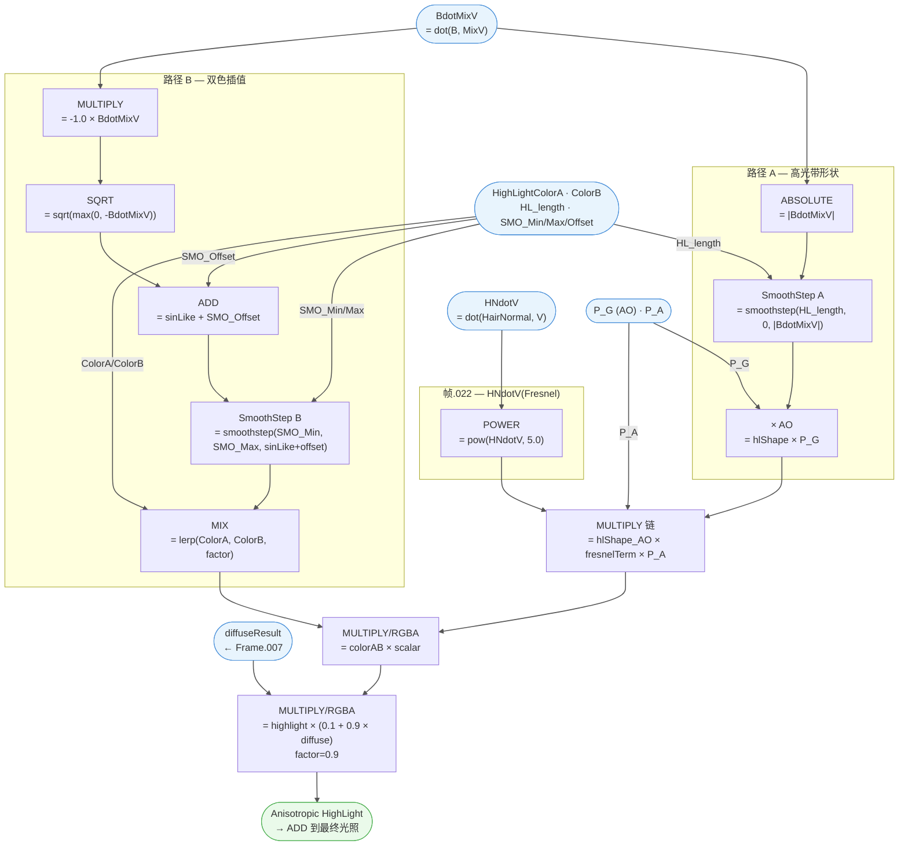

# 🔬 Frame.008 — Anisotropic HighLight 详细分析

> 溯源：`docs/raw_data/Arknights__Endfield_PBRToonBaseHair_20260301.json`
> 提取日期：20260306
> 相关文件：`hlsl/M_actor_laevat_hair_01/PBRToonBaseHair.hlsl`（Frame.008 段）、`hlsl/SubGroups/SubGroups.hlsl`
> 上级架构：`docs/analysis/Materials/M_actor_laevat_hair_01/01_shader_arch.md`
> 所属群组：`Arknights: Endfield_PBRToonBaseHair`（388 节点）
> 所属材质：`M_actor_laevat_hair_01`

---

## 📋 模块概述

| 指标 | 值 |
|------|-----|
| 父框 | `Frame.008` |
| 总节点数 | 26（含 2 个 FRAME 子框、6 个 GROUP_INPUT、5 个 REROUTE） |
| 逻辑节点 | 13（8 MATH + 3 MIX + 2 GROUP） |
| 子框（帧） | `帧.022`（HNdotV(Fresnel)）、`Frame.001`（HighLight） |
| 子群组调用 | `SmoothStep`（群组.021）、`SmoothStep`（群组.023） |
| 运算节点 | `MATH` ×8（MULTIPLY ×4、ABSOLUTE ×1、POWER ×1、SQRT ×1、ADD ×1）、`MIX` ×3（MIX ×1、MULTIPLY ×2） |

**职责**：基于 Kajiya-Kay 风格的发丝各向异性高光计算——通过 B·MixV 投影生成高光带形状，双色 SmoothStep 插值产生颜色渐变，HNdotV Fresnel 项增强边缘高光，最终结果受 AO、P_A 和 Diffuse 光照调制后输出。

---

## 📖 理论背景

### 1. Kajiya-Kay 发丝高光模型

经典 Kajiya-Kay 模型将每根头发建模为无限细的圆柱体，高光项基于光线方向 L、视线方向 V 与发丝切线方向 T 的关系：

$$\text{specular} = (\mathbf{T} \cdot \mathbf{L})(\mathbf{T} \cdot \mathbf{V}) + \sin\theta_L \cdot \sin\theta_V$$

其中 $\sin\theta = \sqrt{1 - (\mathbf{T} \cdot \mathbf{H})^2}$。

### 2. 本 Frame 的简化

本实现**不使用标准 Kajiya-Kay 公式**，而是采用简化的 **B·MixV 投影法**：

- 使用**副法线 B**（= cross(N, HairNormal)）代替切线 T
- 使用**偏移后的视线 MixV**（= V + FHighLightPos 偏移）代替半向量 H
- 高光形状由 **|B·MixV|** 经 SmoothStep 卡通化控制，而非标准 sinθ
- 颜色渐变由 **sqrt(-B·MixV)** 的单侧投影驱动双色插值
- HNdotV 的 Fresnel 项（pow5）提供边缘增强

这种简化牺牲了物理精确性，但更适合 Toon 风格渲染的高光控制。

---

## 🗂️ 节点清单

| 节点名 | 类型 | 操作/功能 | 所属子框 |
|--------|------|-----------|---------|
| `运算.004` | MATH | ABSOLUTE — \|BdotMixV\| | — |
| `群组.021` | GROUP | SmoothStep（高光带形状） | — |
| `运算.003` | MATH | MULTIPLY — hlShape × AO | — |
| `运算.011` | MATH | MULTIPLY — -1.0 × BdotMixV（取反） | — |
| `运算.010` | MATH | SQRT — sqrt(-BdotMixV) | — |
| `运算.016` | MATH | ADD — sinLike + SMO_Offset | — |
| `群组.023` | GROUP | SmoothStep（颜色插值因子） | — |
| `混合.001` | MIX | MIX/RGBA — lerp(ColorA, ColorB, factor) | — |
| `运算.005` | MATH | POWER — pow(HNdotV, 5.0) | `帧.022` |
| `运算.006` | MATH | MULTIPLY — hlShape_AO × fresnelTerm | — |
| `运算.007` | MATH | MULTIPLY — 运算.006 × P_A | — |
| `混合.014` | MIX | MULTIPLY/RGBA — colorAB × scalar（factor=1.0） | — |
| `混合.016` | MIX | MULTIPLY/RGBA — highlight × diffuseResult（factor=0.9） | — |
| `Reroute.004` | REROUTE | 传递混合.014结果 | `Frame.001` |
| `Reroute.030` | REROUTE | 传递 fresnelTerm | — |
| `Reroute.086` | REROUTE | 传递 P_G（AO） | — |
| `Reroute.087` | REROUTE | 传递 P_A | — |
| `Reroute.092` | REROUTE | 传递 P_G → 运算.003 | — |
| `Reroute.093` | REROUTE | 传递 P_A → 运算.007 | — |
| `Group Input.033` | GROUP_INPUT | HighLightColorA | — |
| `Group Input.034` | GROUP_INPUT | HighLightColorB | — |
| `Group Input.036` | GROUP_INPUT | Highlight length | — |
| `Group Input.039` | GROUP_INPUT | Hair HighLight Color Lerp SMO Min | — |
| `Group Input.040` | GROUP_INPUT | Hair HighLight Color Lerp SMO Max | — |
| `Group Input.041` | GROUP_INPUT | Hair HighLight Color Lerp SMO Offset | — |

---

## 📥 外部输入来源

| 输入变量 | 类型 | 来源 Frame | 来源路径 |
|---------|------|-----------|---------|
| **`BdotMixV`** | VALUE | Frame.013 Init | Frame.005(BdotMixV) → dot(B, MixV) → Reroute.002 |
| **`HNdotV`** | VALUE | Frame.013 Init | Frame.004(HNdotV) → dot(HairNormal, V) → Reroute.033 |
| **`diffuseResult`** | RGBA | Frame.007 Diffuse BRDF | 运算.002 → Reroute.034 |
| **`P_G`** (AO) | VALUE | Frame.014 GetSurfaceData | 分离XYZ.006 → 帧.051(P_G) → Reroute.088 |
| **`P_A`** | VALUE | Frame.014 GetSurfaceData | Group Input.009 → 帧.009(P_A) → Reroute.089 |
| **`HighLightColorA`** | RGBA | 群组接口 | Group Input.033 |
| **`HighLightColorB`** | RGBA | 群组接口 | Group Input.034 |
| **`Highlight length`** | VALUE | 群组接口 | Group Input.036（default ≈ 0.09） |
| **`SMO Min`** | VALUE | 群组接口 | Group Input.039 |
| **`SMO Max`** | VALUE | 群组接口 | Group Input.040 |
| **`SMO Offset`** | VALUE | 群组接口 | Group Input.041 |

---

## 📤 外部输出

| 输出变量 | 类型 | 目标 | 说明 |
|---------|------|------|------|
| **`混合.016.Result`** | RGBA | `混合.013.B`（根级 ADD 混合） | 发丝高光 × diffuse 调制后加入最终光照 |

---

## 📊 计算流程



---

## 📦 子框功能说明

| 子框 | 标签 | 内含节点 | 语义 |
|------|------|---------|------|
| `帧.022` | **HNdotV(Fresnel)** | `运算.005` (POWER) | 计算 pow(HNdotV, 5.0) 作为发丝 Fresnel 项，增强边缘视角的高光强度 |
| `Frame.001` | **HighLight** | `Reroute.004` | 信号路由框，传递混合.014 的最终高光颜色到混合.016 |

---

## 📌 计算链路详解

### 路径 A — 高光带形状（Shape Mask）

```
BdotMixV → ABSOLUTE → |BdotMixV|
                          ↓
         SmoothStep(|BdotMixV|, min=HL_length, max=0.0) → hlShape
                                                             ↓
                                              hlShape × P_G(AO) → hlShape_AO
```

- **`SmoothStep(x, min=HL_length, max=0)`**：当 min > max 时，SmoothStep 产生反向渐变——当 |BdotMixV| 接近 0（发丝正对视线方向）时输出较高，|BdotMixV| 增大（发丝侧面）时输出降低
- **`Highlight length`** 参数（默认 ≈ 0.09）控制高光带的宽度：值越大，高光带越窄
- AO 衰减确保被遮蔽区域不出现高光

### 路径 B — 双色插值（Color Gradient）

```
BdotMixV → × (-1.0) → -BdotMixV
                            ↓
                      SQRT(-BdotMixV)   // Blender clamps negative to 0
                            ↓
                  + SMO_Offset → colorLerpInput
                            ↓
         SmoothStep(colorLerpInput, SMO_Min, SMO_Max) → colorLerpFactor
                                                            ↓
                     lerp(HighLightColorA, HighLightColorB, factor) → colorAB
```

- **`sqrt(-BdotMixV)`** 仅在 BdotMixV < 0 时有效（Blender 对负数 SQRT 返回 0），产生单侧高光颜色渐变
- 这创造了一种不对称的双色效果：发丝一侧显示 ColorA，另一侧渐变到 ColorB
- **SMO Offset** 控制颜色过渡的整体偏移位置

### Fresnel 项

```
HNdotV → pow(HNdotV, 5.0) → fresnelTerm   [帧.022]
```

- 使用发丝法线（HairNormal）而非表面法线 N 计算 Fresnel
- 指数 5.0 使效果集中在掠射角（视线几乎平行于发丝法线方向），增强边缘高光

### 最终组装

```
hlShape_AO × fresnelTerm → 运算.006
运算.006 × P_A           → 运算.007 (scalar)
colorAB × scalar          → 混合.014 (MULTIPLY/RGBA, factor=1.0)
混合.014 × diffuseResult  → 混合.016 (MULTIPLY/RGBA, factor=0.9)
```

- **P_A** 作为额外遮罩（来自 _P 贴图 Alpha，可能用于区域控制）
- **混合.016**（factor=0.9）：`Result = highlightColor × (0.1 + 0.9 × diffuseResult)` — 在阴影区保留 10% 高光，防止完全消失

---

## 💻 HLSL 等价（完整）

```cpp
// =============================================================================
// Frame.008 — Anisotropic HighLight
// 群组：Arknights: Endfield_PBRToonBaseHair
// 溯源：docs/raw_data/Arknights__Endfield_PBRToonBaseHair_20260301.json → Frame.008
// =============================================================================

// --- 入参（来自外部 Frame 或群组接口）---
// BdotMixV        : float  ← Frame.013 Init / Frame.005(BdotMixV) = dot(B, MixV)
// HNdotV          : float  ← Frame.013 Init / Frame.004(HNdotV) = dot(HairNormal, V)
// diffuseResult   : float3 ← Frame.007 Diffuse BRDF
// P_G             : float  ← Frame.014 GetSurfaceData (AO)
// P_A             : float  ← Frame.014 GetSurfaceData (贴图Alpha/区域遮罩)
// HighLightColorA : float3 ← 群组接口
// HighLightColorB : float3 ← 群组接口
// HL_length       : float  ← 群组接口 "Highlight length" (default ≈ 0.09)
// SMO_Min         : float  ← 群组接口 "Hair HighLight Color Lerp SMO Min"
// SMO_Max         : float  ← 群组接口 "Hair HighLight Color Lerp SMO Max"
// SMO_Offset      : float  ← 群组接口 "Hair HighLight Color Lerp SMO Offset"

float3 Frame008_AnisotropicHighLight(
    float  BdotMixV,
    float  HNdotV,
    float3 diffuseResult,
    float  P_G,            // AO
    float  P_A,            // 区域遮罩
    float3 HighLightColorA,
    float3 HighLightColorB,
    float  HL_length,
    float  SMO_Min,
    float  SMO_Max,
    float  SMO_Offset
)
{
    // ── Path A: 高光带形状 (Shape Mask) ─────────────────────────────────
    // [运算.004] ABSOLUTE
    float absBdotMixV = abs(BdotMixV);

    // [群组.021] SmoothStep — 高光带宽度控制
    // min=HL_length, max=0 → 反向 SmoothStep：中心(BdotMixV≈0)输出高，边缘输出低
    float hlShape = SmoothStep(HL_length, 0.0, absBdotMixV);

    // [运算.003] MULTIPLY — AO 衰减
    float hlShape_AO = hlShape * P_G;

    // ── Path B: 双色插值 (Color Gradient) ───────────────────────────────
    // [运算.011] MULTIPLY — 取反
    float negBdotMixV = -1.0 * BdotMixV;

    // [运算.010] SQRT — 单侧渐变 (BdotMixV < 0 时有效，否则 clamp 到 0)
    float sinLike = sqrt(max(0.0, negBdotMixV));

    // [运算.016] ADD — 偏移
    float colorLerpInput = sinLike + SMO_Offset;

    // [群组.023] SmoothStep — 颜色插值因子
    float colorLerpFactor = SmoothStep(SMO_Min, SMO_Max, colorLerpInput);

    // [混合.001] MIX/RGBA — 双色插值
    float3 colorAB = lerp(HighLightColorA, HighLightColorB, colorLerpFactor);

    // ── 帧.022: HNdotV Fresnel ──────────────────────────────────────────
    // [运算.005] POWER
    float fresnelTerm = pow(HNdotV, 5.0);

    // ── 最终组装 ─────────────────────────────────────────────────────────
    // [运算.006] hlShape_AO × fresnelTerm
    float highlightMask = hlShape_AO * fresnelTerm;

    // [运算.007] × P_A (区域遮罩)
    float scalar = highlightMask * P_A;

    // [混合.014] MULTIPLY/RGBA — colorAB × scalar (factor=1.0)
    float3 highlightColor = colorAB * scalar;

    // [混合.016] MULTIPLY/RGBA — highlight × diffuse 调制 (factor=0.9)
    // Blender MIX MULTIPLY: result = lerp(A, A*B, factor)
    //                      = A * (1 - factor + factor * B)
    //                      = A * (0.1 + 0.9 * B)
    float3 result = highlightColor * (0.1 + 0.9 * diffuseResult);

    // → 输出到 混合.013 (ADD) 加入最终光照
    return result;
}
```

---

## 🔗 子群组参考

Frame.008 仅调用 `SmoothStep` 子群组（2次调用），L2 层节点。

| 群组 | 层级 | 节点数 | 职责摘要 | 详细文档 |
|-----|-----|:---:|---------|---------|
| [`SmoothStep`](../sub_groups/SmoothStep.md) | L2 | 6 | 三次 Hermite 平滑阶梯函数 smoothstep(min, max, x) | [SmoothStep.md](../sub_groups/SmoothStep.md) |

---

## 🔗 子群组调用树

```
Frame.008 Anisotropic HighLight
├── 群组.021  SmoothStep          ← L2（高光带形状，详见 SmoothStep.md）
│   └── 无 L3 子群组（叶节点）
└── 群组.023  SmoothStep          ← L2（颜色插值因子，详见 SmoothStep.md）
    └── 无 L3 子群组（叶节点）
```

> **调用深度**：Frame.008 → L2（2个 SmoothStep 实例）→ 无 L3

---

## ⚙️ PBRToonBaseHair 特化参数

| 参数 | 默认值 | 说明 |
|------|----|------|
| `Highlight length` | **0.09** | SmoothStep A 的 min 值，控制高光带宽度。值越大，带越窄 |
| `SmoothStep A max` | **0.0** | 固定为 0，与 min 形成反向 SmoothStep |
| `Hair HighLight Color Lerp SMO Min` | 群组接口 | SmoothStep B 的 min，控制颜色过渡起始 |
| `Hair HighLight Color Lerp SMO Max` | 群组接口 | SmoothStep B 的 max，控制颜色过渡结束 |
| `Hair HighLight Color Lerp SMO Offset` | 群组接口 | 颜色过渡的位置偏移 |
| `HighLightColorA` | RGBA | 双色高光的第一色（BdotMixV 正侧） |
| `HighLightColorB` | RGBA | 双色高光的第二色（BdotMixV 负侧渐变） |
| `混合.016 factor` | **0.9** | Diffuse 调制强度，0.1 为阴影区残留高光比例 |

---

## 📌 与其他 Frame 的边界

| 边界方向 | Frame | 传递的变量 |
|---------|-------|-----------|
| **接收** | Frame.013 Init | `BdotMixV`（dot(B, MixV)）、`HNdotV`（dot(HairNormal, V)） |
| **接收** | Frame.014 GetSurfaceData | `P_G`（AO）、`P_A`（贴图 Alpha） |
| **接收** | Frame.007 Diffuse BRDF | `diffuseResult`（漫反射光照结果） |
| **输出** | 根级 混合.013（ADD） | `AnisotropicHighLight`（发丝高光，加入最终光照组合） |

---

## 💡 设计要点

| 要点 | 说明 |
|------|------|
| **简化 Kajiya-Kay** | 不使用标准 sinθ = sqrt(1-(T·H)²) 公式，改用 \|B·MixV\| + SmoothStep 卡通化，更易调参 |
| **单侧颜色渐变** | sqrt(-BdotMixV) 仅在 B·MixV < 0 时有效，创造不对称的双色效果 |
| **反向 SmoothStep** | min=HL_length > max=0 实现"中心亮、边缘暗"的高光带 |
| **Diffuse 调制** | factor=0.9 的 MULTIPLY 混合确保阴影区保留 10% 高光，避免完全消失 |
| **HNdotV Fresnel** | 使用发丝法线而非表面法线，pow5 指数集中在掠射角增强 |
| **多重遮罩** | AO(P_G) × P_A × fresnelTerm × diffuse 四层调制，精确控制高光可见性 |

---

## 🎮 Unity URP 迁移要点

| 要点 | Unity URP 处理 |
|------|---------------|
| **SmoothStep** | 直接使用 HLSL 内置 `smoothstep(edge0, edge1, x)` |
| **BdotMixV 计算** | 需在顶点或片元着色器中计算副法线 B 和偏移视线 MixV |
| **发丝法线 HairNormal** | 需从 _HN 贴图解码发丝切线方向，Unity 无内置等价 |
| **Diffuse 调制** | 简单乘法 `highlight * (0.1 + 0.9 * diffuse)` |
| **双色插值** | `lerp(ColorA, ColorB, smoothstep(min, max, sqrt(max(0,-BdotMixV))+offset))` |
| **无 URP 内置等价** | 🔴 需完全自行实现，Unity 不提供发丝各向异性高光的标准接口 |

---

## ❓ 待确认

- [ ] `P_A` 在发丝材质中的具体语义——是否为 RampUV 行选择，还是高光区域遮罩？
- [ ] `sqrt(-BdotMixV)` 单侧效果是否为设计意图，还是应结合绝对值使用？
- [ ] `混合.016 factor=0.9` 是否为硬编码值，还是应暴露为可调参数？
- [ ] `FHighLightPos` 偏移在 Frame.013 中如何施加到 MixV 上的具体计算方式
