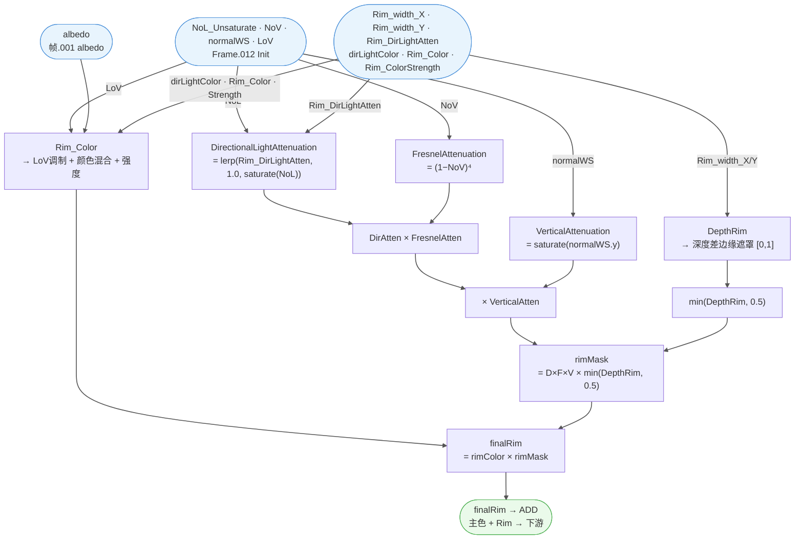

# 🔬 Frame.009 — Rim 详细分析

> 溯源：`docs/raw_data/PBRToonBase_full_20260227.json`（MCP 直查，JSON 缺少 parent 字段）
> 提取日期：2026-03-05
> 相关文件：`hlsl/PBRToonBase.hlsl`（Frame.009 段）、`hlsl/SubGroups/SubGroups.hlsl`
> 上级架构：`docs/analysis/Materials/M_actor_pelica_cloth_04/01_shader_arch.md`

---

## 📋 模块概述

| 指标 | 值 |
|------|----|
| Frame 节点名 | `Frame.009`（英文名） |
| 模块标签 | **Rim** |
| 总子节点数 | 20 |
| 子框（帧） | 5：`帧.041`（DepthRim）· `帧.042`（Fresnel attenuation）· `帧.043`（Vertical attenuation）· `帧.045`（Directional light attenuation）· `帧.046`（Rim_Color） |
| 子群组调用数 | 5（5 个唯一） |
| 运算节点 | `MATH` ×4 + `MIX` ×1 |
| Group Input | 5 个（+ 1 个视觉上在 Frame 外的 Group Input.042） |

**职责**：计算多因子叠加的边缘光（Rim Light）效果。通过深度检测（DepthRim）、菲涅尔（FresnelAttenuation）、垂直衰减（VerticalAttenuation）、平行光方向衰减（DirectionalLightAttenuation）四路遮罩相乘生成 rimMask；由 Rim_Color 子群组计算边缘光颜色；最终 `rimColor × rimMask` 以 **ADD 加法**叠加到主光照链路。

---

## 🗂️ 节点清单

| 节点名 | 类型 | 功能 | 所属子框 |
|--------|------|------|---------|
| `群组.016` | GROUP `DepthRim` | 屏幕空间深度差边缘检测遮罩 | `帧.041` |
| `群组.014` | GROUP `Fresnel attenuation` | 菲涅尔视角衰减 (1−NoV)⁴ | `帧.042` |
| `群组.015` | GROUP `Vertical attenuation` | 法线垂直分量衰减 | `帧.043` |
| `群组.013` | GROUP `Directional light attenuation` | 平行光方向响应衰减 | `帧.045` |
| `群组.018` | GROUP `Rim_Color` | Rim 颜色计算（albedo + 灯光色混合） | `帧.046` |
| `运算.026` | MATH MULTIPLY | `DirLightAtten × FresnelAtten` | — |
| `运算.027` | MATH MULTIPLY | `(D×F) × VerticalAtten` | — |
| `运算.029` | MATH MINIMUM | `min(DepthRim, 0.5)` | — |
| `运算.028` | MATH MULTIPLY | `(D×F×V) × min(DepthRim, 0.5)` = **rimMask** | — |
| `混合.018` | MIX MULTIPLY (RGBA) | `rimColor × rimMask` = **finalRim** | — |
| `Group Input.030` | GROUP_INPUT | `dirLight_lightColor` | — |
| `Group Input.040` | GROUP_INPUT | `Rim_DirLightAtten` | — |
| `Group Input.041` | GROUP_INPUT | `Rim_width_X` | — |
| `Group Input.043` | GROUP_INPUT | `Rim_Color` | — |
| `Group Input.044` | GROUP_INPUT | `Rim_ColorStrength` | — |
| `帧.041~.046` | FRAME | 可视分组（无插槽，不参与计算） | — |

> `Group Input.042`（`Rim_width_Y`）在视觉上位于 Frame.009 外，但连线指向内部 `群组.016.Rim_width_Y`，逻辑上属于本 Frame。

---

## 📥 外部输入来源

| 输入变量 | 中继节点 | 来源 Frame/节点 | 目标（Frame.009 内） |
|---------|---------|----------------|---------------------|
| `NoV`（dot(N,V)） | `Reroute.049` → `Reroute.063` | Frame.012 Init（`Vector Math.002`，saturate 前） | `群组.014.NoV` |
| `LoV`（dot(L,V)） | `Reroute.046` → `Reroute.064` | Frame.012 Init（`Vector Math.001`，`几何数据.003.Incoming` × 灯光属性 L） | `群组.018.LoV` |
| `NoL_Unsaturate`（dot(N,L)，未截断） | `Reroute.044` → `Reroute.065` | Frame.012 Init（`Vector Math`，normalWS × 灯光方向属性） | `群组.013.NoL_Unsaturate` |
| `albedo`（基础色） | `Reroute.013` → `Reroute.025` → `Reroute.024` → `Reroute.066` | `帧.001 albedo`（`混合` MULTIPLY: `混合.035` × `BaseColor`） | `群组.018.albedo` |
| `Rim_width_X` | `Group Input.041`（Frame 内） | 材质参数 | `群组.016.Rim_width_X` |
| `Rim_width_Y` | `Group Input.042`（Frame 外） | 材质参数 | `群组.016.Rim_width_Y` |
| `Rim_DirLightAtten` | `Group Input.040`（Frame 内） | 材质参数 | `群组.013.Directional light attenuation adjust` |
| `dirLight_lightColor` | `Group Input.030`（Frame 内） | 材质参数 | `群组.018.dirLight_lightColor` |
| `Rim_Color` | `Group Input.043`（Frame 内） | 材质参数 | `群组.018.Rim_Color` |
| `Rim_ColorStrength` | `Group Input.044`（Frame 内） | 材质参数 | `群组.018.Rim_ColorStrength` |

---

## 📤 外部输出

| Frame 内节点 | Socket | 中继 | 目标节点/语义 |
|--------------|--------|------|--------------|
| `混合.018` | `Result`（RGBA） | `转接点.106` | `混合.019.B`（ADD 叠加到主光照，在 Frame.008 ToonFresnel 之后） |

> **ADD 叠加**：`混合.019（ADD）= 混合.012.Result（主色）+ 转接点.106（Rim）`
> → 结果送 `混合.026.A`（继续下游 Emission / Alpha 处理）。

---

## 🔗 子群组

| 子群组 | 节点名 | 所属子框 | 文档状态 | 主要功能 |
|--------|--------|---------|----------|---------|
| `DepthRim` | `群组.016` | `帧.041` | ✅ 已有文档 | 屏幕空间法线偏移深度差，输出 [0,1] 边缘遮罩 |
| `Fresnel attenuation` | `群组.014` | `帧.042` | ✅ 已有文档 | (1−NoV)⁴，grazing angle 处 Rim 最强 |
| `Vertical attenuation` | `群组.015` | `帧.043` | ✅ 已有文档 | `saturate(normalWS.y)`，顶部强底部弱 |
| `Directional light attenuation` | `群组.013` | `帧.045` | ✅ 已有文档 | `lerp(Rim_DirLightAtten, 1.0, saturate(NoL))`，背光侧保留量 |
| `Rim_Color` | `群组.018` | `帧.046` | ✅ 已有文档 | LoV 衰减 + albedo/灯光色混合 + 强度系数缩放 |

> 所有子群组均已有文档，**无需重新提取**。

---

## 📊 计算流程



---

## 📦 子框功能说明

| 子框 | 标签 | 包含节点 | 语义 |
|------|------|---------|------|
| `帧.041` | **DepthRim** | `群组.016` | 屏幕空间深度差边缘检测 |
| `帧.042` | **Fresnel attenuation** | `群组.014` | 菲涅尔视角遮罩 |
| `帧.043` | **Vertical attenuation** | `群组.015` | 法线垂直分量衰减 |
| `帧.045` | **Directional light attenuation** | `群组.013` | 平行光方向响应系数 |
| `帧.046` | **Rim_Color** | `群组.018` | 边缘光颜色（染色 + 强度） |

---

## 📌 遮罩乘法链路

Frame.009 的 rimMask 由四路因子依次相乘：

```
DirLightAtten(NoL, Rim_DirLightAtten)   [帧.045]
    × FresnelAtten(NoV)                  [帧.042]   → 运算.026
    × VerticalAtten(normalWS.y)          [帧.043]   → 运算.027
    × min(DepthRim(width_X, Y), 0.5)    [帧.041]   → 运算.029 → 运算.028
    = rimMask
```

颜色与遮罩合并：

```
rimColor  [帧.046]
    × rimMask                                        → 混合.018 (MULTIPLY)
    = finalRim → ADD 叠加到主色 (混合.019)
```

---

## 💻 HLSL 等价（完整）

```cpp
// =============================================================================
// Frame.009 — Rim
// 群组：Arknights: Endfield_PBRToonBase  |  溯源：PBRToonBase_full_20260227.json（MCP 直查）
// 子群组：5（全部已有文档）  |  运算：MATH×4（MULTIPLY×3 + MINIMUM×1）+ MIX×1（MULTIPLY RGBA）
// =============================================================================

// --- 入参（来自外部 Frame 或群组接口）---
// NoL_Unsaturate    : float   ← Frame.012 Init（dot(normalWS, lightDir)，未 saturate，via Reroute.044/065）
// NoV               : float   ← Frame.012 Init（dot(normalWS, viewDir)，via Reroute.045/063）
// LoV               : float   ← Frame.012 Init（dot(lightDir, viewDir)，via Reroute.046/064）
// albedo            : float3  ← 帧.001 albedo（BaseColor × _D sRGB 处理，via Reroute.013/025/024/066）
// Rim_width_X       : float   ← Group Input.041
// Rim_width_Y       : float   ← Group Input.042（视觉上在 Frame 外）
// Rim_DirLightAtten : float   ← Group Input.040（背光面保留量参数）
// dirLightColor     : float3  ← Group Input.030（dirLight_lightColor）
// rimColorParam     : float3  ← Group Input.043（Rim_Color）
// rimColorStrength  : float   ← Group Input.044（Rim_ColorStrength）

float3 Frame_009_Rim(
    float  NoL_Unsaturate,
    float  NoV,
    float  LoV,
    float3 albedo,
    float  Rim_width_X,
    float  Rim_width_Y,
    float  Rim_DirLightAtten,
    float3 dirLightColor,
    float3 rimColorParam,
    float  rimColorStrength,
    // 屏幕空间参数（供 DepthRim 使用）
    float2 screenUV,
    float3 normalVS,
    float3 normalWS
)
{
    // ── Stage 1: 遮罩四因子 ──────────────────────────────────────────────────────

    // 帧.045 — DirectionalLightAttenuation（群组.013）
    // lerp(Rim_DirLightAtten, 1.0, saturate(NoL))
    // 背光侧（NoL<0）时保留 Rim_DirLightAtten 量的光照，受光侧完全保留
    float dirLightAtten = DirectionalLightAttenuation(NoL_Unsaturate, Rim_DirLightAtten);
    // 见 sub_groups/DirectionalLightAttenuation.md

    // 帧.042 — FresnelAttenuation（群组.014）
    // (1 - NoV)^4，grazing angle 处 Rim 最强，正对视角时 Rim 消失
    float fresnelAtten = FresnelAttenuation(NoV);
    // 见 sub_groups/FresnelAttenuation.md

    // 帧.043 — VerticalAttenuation（群组.015）
    // saturate(normalWS.y)（Unity Y = 世界上方向）
    // 法线朝上时 Rim 最强，朝下时消失
    float verticalAtten = VerticalAttenuation(normalWS);
    // 见 sub_groups/VerticalAttenuation.md

    // 帧.041 — DepthRim（群组.016）
    // 屏幕空间法线偏移后采样深度差，检测几何轮廓边缘
    float depthRim = DepthRim(screenUV, normalVS, Rim_width_X, Rim_width_Y);
    // 见 sub_groups/DepthRim.md

    // ── Stage 2: 遮罩合并 ────────────────────────────────────────────────────────

    // 运算.026 MULTIPLY：DirLightAtten × FresnelAtten
    float maskDF  = dirLightAtten * fresnelAtten;                   // 运算.026

    // 运算.027 MULTIPLY：× VerticalAtten
    float maskDFV = maskDF * verticalAtten;                         // 运算.027

    // 运算.029 MINIMUM：将 DepthRim 贡献上限截断为 0.5
    // 防止深度边缘遮罩与其他三路因子相乘后过曝
    float depthRimCapped = min(depthRim, 0.5);                     // 运算.029

    // 运算.028 MULTIPLY：最终 rimMask
    float rimMask = maskDFV * depthRimCapped;                      // 运算.028

    // ── Stage 3: 边缘光颜色（帧.046 Rim_Color，群组.018）────────────────────────
    // LoV 衰减（光从正面照射时降低 Rim 强度） + albedo/灯光色混合 + 强度系数
    float3 finalRimColor = RimColor(albedo, dirLightColor, rimColorParam, rimColorStrength, LoV);
    // 见 sub_groups/Rim_Color.md

    // ── Stage 4: 颜色 × 遮罩（混合.018 MIX MULTIPLY RGBA, Factor=1.0）───────────
    float3 finalRim = finalRimColor * rimMask;                     // 混合.018

    return finalRim;
    // → 转接点.106 → 混合.019.B（ADD 叠加）
    // 混合.019（ADD）= 混合.012.Result（主色，Frame.008 ToonFresnel 之后）+ finalRim
    // → 混合.026.A（继续下游 Emission/Alpha 处理）
}
```

---

## 🔗 子群组参考

| 子群组 | 节点名 | 层级 | 职责摘要 | 详细文档 |
|--------|--------|:----:|---------|---------|
| `DepthRim` | `群组.016` | L2 | 屏幕空间深度差 → [0,1] 边缘遮罩 | [DepthRim.md](../sub_groups/DepthRim.md) |
| `Fresnel attenuation` | `群组.014` | L2 | (1-NoV)^4 Rim 视角衰减 | [FresnelAttenuation.md](../sub_groups/FresnelAttenuation.md) |
| `Vertical attenuation` | `群组.015` | L2 | saturate(normalWS.y) 垂直衰减 | [VerticalAttenuation.md](../sub_groups/VerticalAttenuation.md) |
| `Directional light attenuation` | `群组.013` | L2 | lerp(adj, 1.0, sat(NoL)) 方向衰减 | [DirectionalLightAttenuation.md](../sub_groups/DirectionalLightAttenuation.md) |
| `Rim_Color` | `群组.018` | L2 | LoV 调制 + 颜色混合 + 强度 | [Rim_Color.md](../sub_groups/Rim_Color.md) |

---

## 🔗 子群组调用树

```
Frame.009 Rim
├── 群组.013  Directional light attenuation    ← L2（详见 DirectionalLightAttenuation.md）
├── 群组.014  Fresnel attenuation              ← L2（详见 FresnelAttenuation.md）
├── 群组.015  Vertical attenuation             ← L2（详见 VerticalAttenuation.md）
├── 群组.016  DepthRim                         ← L2（详见 DepthRim.md）
└── 群组.018  Rim_Color                        ← L2（详见 Rim_Color.md）
```

> **调用深度**：Frame.009 → L2（5个，均为叶节点，无 L3 调用）

---

## ⚙️ M_actor_pelica_cloth_04 特化参数

| 参数 | 含义 | 说明 |
|------|------|------|
| `Rim_width_X` / `Rim_width_Y` | 深度 Rim 宽度（屏幕空间 XY） | 控制 DepthRim 检测的偏移量，通常各轴独立调节以匹配屏幕长宽比 |
| `Rim_DirLightAtten` | 背光侧 Rim 保留量 | 0 = 背光侧无 Rim，1 = 全方向均匀 Rim；一般设为小值使 Rim 偏背光侧 |
| `Rim_Color` | 边缘光基础色 | 与平行光颜色及 albedo 混合后输出 |
| `Rim_ColorStrength` | 边缘光强度 | 整体乘法系数，美术控制亮度 |

---

## 📌 与其他 Frame 的边界

| 边界方向 | Frame / 层级 | 传递的变量 |
|---------|-------------|-----------|
| **接收** | Frame.012 Init | `NoL_Unsaturate`（dot(N,L) 未截断，via Reroute.044/065） |
| **接收** | Frame.012 Init | `NoV`（dot(N,V)，via Reroute.045/063） |
| **接收** | Frame.012 Init | `LoV`（dot(L,V)，via Reroute.046/064） |
| **接收** | 帧.001 albedo 区域 | `albedo`（BaseColor × _D 混合，via Reroute.013/025/024/066） |
| **接收** | Group Input | `Rim_width_X/Y`·`Rim_DirLightAtten`·`dirLight_lightColor`·`Rim_Color`·`Rim_ColorStrength` |
| **输出** | `混合.019.B`（ADD） | `finalRim`（= rimColor × rimMask，via 转接点.106） |
| **下游** | `混合.026.A` | `混合.019.Result`（主色 + Rim），继续 Emission/Alpha 处理 |

---

## 💡 设计要点

| 要点 | 说明 |
|------|------|
| **四因子遮罩相乘** | DirLightAtten × FresnelAtten × VerticalAtten × min(DepthRim, 0.5)，各因子独立控制 Rim 不同维度的形状 |
| **MINIMUM(DepthRim, 0.5)** | `运算.029` 将 DepthRim 贡献截断为 0.5，防止深度边缘与其他三路相乘后过曝；四路相乘后整体幅值本已较小 |
| **DirectionalLightAttenuation 的 Rim 语义** | `lerp(Rim_DirLightAtten, 1.0, saturate(NoL))` 控制 Rim 在背光侧的保留量——传统 Rim 在背光侧最强，此参数允许美术微调"背光 Rim 与正面 Rim 的比率" |
| **ADD 最终合并** | `混合.019（ADD）` 将 Rim 加法叠加到主色，Rim 是自发光性质的加分项，不消减主光照亮度 |
| **LoV 调制 Rim 颜色** | `LoV = dot(L,V)`，当光照方向与视角接近（正面直射）时降低 Rim 颜色强度，避免 Rim 在主光面过亮 |
| **Group Input.042 越界** | `Rim_width_Y` 的 Group Input 节点视觉上在 Frame.009 外，但逻辑上是本 Frame 的参数；移植时视为 Frame 内参数处理 |
| **无 Reroute 中转的假出边** | `转接点.092/094/095/098/104` 是 Blender 布线跨越 Frame 边界的中转节点，逻辑上属于 Frame.009 内部连线，不是真正的外部输出 |

---

## 🎮 Unity URP 迁移要点

| 要点 | Unity URP 处理 |
|------|---------------|
| `DepthRim` | 需开启 `Depth Texture`；用 `_CameraDepthTexture` 实现深度差采样（见 DepthRim.md）；`ScreenspaceInfo` 是 Goo Engine 专有节点，需手动替换 |
| `VerticalAttenuation` | `saturate(IN.normalWS.y)` 直接可用（Unity Y = 世界上方向） |
| `FresnelAttenuation` | `pow(1.0 - saturate(dot(N, V)), 4.0)` 直接可用 |
| `DirectionalLightAttenuation` | `lerp(Rim_DirLightAtten, 1.0, saturate(NoL))` 直接可用 |
| `MINIMUM(DepthRim, 0.5)` | `min(depthRim, 0.5)` 直接可用 |
| `Rim_Color ADD 叠加` | `color += rimColor * rimMask`（additive），在 emission 添加阶段处理 |
| `normalWS.y` for VerticalAtten | `IN.normalWS.y` in URP fragment（需确认法线是否已经过 normalMap 调制）；VerticalAttenuation 使用的是几何/世界法线，与 normalMap 无关 |

---

## ❓ 待确认

- [ ] `运算.029 MINIMUM` 的第二输入：读出默认值 0.5，但 Blender MATH 节点默认均为 0.5，需在 Blender 界面直接确认是否为美术显式设置还是节点出厂默认未改动（若为 1.0 则 MINIMUM 退化为 pass-through）
- [ ] `混合.019（ADD）` 的 Factor 值：当前假设 Factor=1.0（全强度 ADD）；若 Factor 可调则为 `lerp(A, A+B, Factor)`，需确认
- [ ] `Reroute.013` 上游的 `混合`（MULTIPLY，帧.001 albedo）的具体前置节点 `混合.035` 是什么处理步骤（推断为 _D sRGB 解码或 tint 处理）
