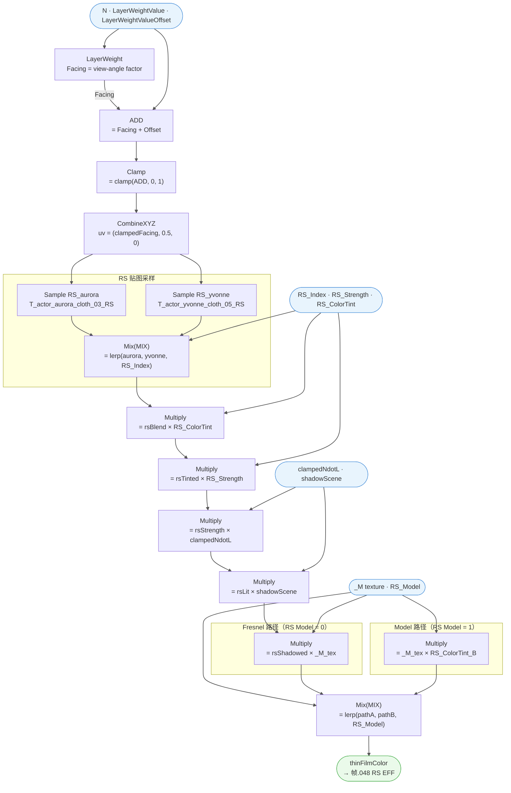

# 🔬 Frame.011 — ThinFilmFilter 详细分析

> 溯源：`docs/raw_data/PBRToonBase_full_20260227.json`
> 提取日期：20260305
> 相关文件：`hlsl/M_actor_pelica_cloth_04/PBRToonBase.hlsl`（Frame.011 段）、`hlsl/M_actor_pelica_cloth_04/SubGroups/SubGroups.hlsl`
> 上级架构：`docs/analysis/M_actor_pelica_cloth_04/01_shader_arch.md`

---

## 📋 模块概述

| 指标 | 值 |
|------|-----|
| 父框 | `Frame.011`（根级，parent=None） |
| 总节点数 | 29（含 1 个 FRAME 子框、9 个 GROUP_INPUT、5 个 REROUTE） |
| 逻辑节点 | 12（LAYER_WEIGHT、MATH、CLAMP、COMBXYZ、TEX_IMAGE×2、MIX×7） |
| 子框（帧） | `帧.070`（无标签，内含 TEX_IMAGE.005） |
| 子群组调用 | **无**（纯内置节点，不调用任何 GROUP 子群组） |
| 运算节点 | `LAYER_WEIGHT` ×1、`MATH(ADD)` ×1、`CLAMP` ×1、`COMBXYZ` ×1、`TEX_IMAGE` ×2、`MIX(MULTIPLY)` ×6、`MIX(MIX)` ×1 |

**职责**：基于视角菲涅耳角度对预烘焙 RS（Rainbow Specular）贴图进行查找采样，生成随视角变化的彩虹薄膜干涉色，并受光照（NdotL、阴影）和遮罩（_M 贴图）调制，最终由 `帧.048 RS EFF` 阶段通过 Use RS_Eff? 开关叠入最终颜色。

---

## 📖 理论背景

### 1. 薄膜干涉物理原理

**薄膜干涉（Thin-Film Interference）**发生于光在薄介质层（厚度接近可见光波长量级，如皂泡膜、昆虫翅鞘、油膜）的两个界面上分别发生反射时：两束反射光的**光程差**为：

```
ΔL = 2 · n · d · cos(θ_t)
```

其中 `n` 为薄膜折射率，`d` 为膜厚，`θ_t` 为折射角（由 Snell 定律与入射角 `θ_i` 关联）。

当光程差满足 `ΔL = m·λ`（整数倍波长）时发生**相长干涉**，对应该波长的颜色被增强；满足 `ΔL = (m+0.5)·λ` 时发生**相消干涉**，对应颜色被压制。

**关键推论**：不同波长（颜色）在不同视角 `θ_i` 下满足相长条件，因此薄膜呈现**随视角偏移的彩虹色谱**——这正是 RS（Rainbow Specular）效果的物理本质。

---

### 2. 预烘焙 RS LUT 近似

实时计算薄膜干涉需要对整个可见光谱积分，代价过高。本 shader 采用**预烘焙 1D LUT** 方案：

| 参数 | 说明 |
|------|------|
| **LUT 横轴（U）** | 视角-法线夹角 `θ`（0=正视，1=掠射），对应 `Facing` 值 |
| **LUT 内容** | 该角度下薄膜干涉增强的 RGB 颜色（离线光谱积分后转 sRGB） |
| **存储形式** | 2D 纹理（RS 贴图），`V=0.5` 固定采样中间行（有效行），本质为 1D LUT 包装成 2D |
| **双贴图设计** | 两张不同角色风格的 RS 贴图通过 `RS_Index` 线性混合，在不同色谱预设间过渡 |

此方案的精度取舍：LUT 由美术手绘或离线计算，角色间色谱差异靠混合权重调节；折射率、膜厚等物理参数不出现在运行时——**完全牺牲物理参数化，换取极低的运行时开销和可控的美术风格**。

---

### 3. Blender LAYER_WEIGHT Facing 节点

`LAYER_WEIGHT` 节点的 **Facing 输出**近似计算视角衰减因子：

```
facing ≈ pow(1 − saturate(dot(N, V)), 1 / blend)
```

与 Schlick 菲涅耳近似的对比：

| | LAYER_WEIGHT Facing | Schlick Fresnel（F_Schlick 子群组） |
|--|--------------------|------------------------------------|
| 公式 | `pow(1−NdotV, 1/blend)` | `F0 + (1−F0)·pow(1−LdotH, 5)` |
| 基于 | 视角-法线角（NdotV） | 光线-半角（LdotH） |
| 参数 | `blend`（陡峭度 0~1） | `F0`（基础反射率） |
| 物理含义 | 艺术化视角衰减 | 导体/电介质的能量反射率 |
| 本 Frame 用途 | 驱动 RS 贴图 U 坐标 | 不用于本 Frame |

`blend` 参数（本材质默认 ≈ 0.9）越大，`facing` 曲线越平缓，RS 彩虹色扩散到更大的视角范围；越小则越集中于掠射角。

---

### 4. 光照调制的物理含义与双路径设计

从物理角度看，薄膜干涉属于**镜面反射**现象：

- 镜面反射强度受入射角（`NdotL`）和阴影（`shadowScene`）调制，在暗部不可见。
- **Fresnel 路径**（RS_Model=0）保留这一调制，近似物理正确的薄膜高光行为。

然而 Toon 渲染中有时需要薄膜色在全光照条件下均匀可见（如固定高亮的彩虹光泽）：

- **Model 路径**（RS_Model=1）剥离光照调制，仅用 `_M` 遮罩限制出现区域，呈现**固定亮度的风格化效果**。

这两种路径体现了 PBR-Toon 混合 shader 的典型设计哲学：保留物理意义的参数通道（Fresnel 路径），同时提供艺术覆盖开关（Model 路径），两者通过 `RS_Model` bool 参数切换。

---

## 🗂️ 节点清单

| 节点名 | 类型 | 标签/功能 | 所属子框 |
|--------|------|-----------|---------|
| `层权重` | LAYER_WEIGHT | 计算菲涅耳 Facing 角度 | — |
| `运算.004` | MATH(ADD) | Facing + LayerWeightValueOffset | — |
| `钳制.001` | CLAMP | clamp(结果, 0, 1) | — |
| `合并 XYZ.004` | COMBXYZ | 构造 UV = (clamped, 0.5, 0) | — |
| `图像纹理.005` | TEX_IMAGE | T_actor_aurora_cloth_03_RS.png | 帧.070 |
| `图像纹理` | TEX_IMAGE | T_actor_yvonne_cloth_05_RS.png | — |
| `混合.032` | MIX(MIX) | 按 RS_Index 混合两张 RS 贴图 | — |
| `混合.036` | MIX(MULTIPLY) | RS 颜色 × RS_ColorTint | — |
| `混合.023` | MIX(MULTIPLY) | × RS_Strength 强度调制 | — |
| `混合.027` | MIX(MULTIPLY) | × clampedNdotL 光照角度调制 | — |
| `混合.028` | MIX(MULTIPLY) | × shadowScene 阴影调制 | — |
| `混合.033` | MIX(MULTIPLY) | × _M 贴图遮罩（Fresnel 路径） | — |
| `混合.038` | MIX(MULTIPLY) | _M × RS_ColorTint（Model 路径） | — |
| `混合.037` | MIX(MIX) | RS_Model 开关：选择 Fresnel/Model 路径 | — |
| `帧.070` | FRAME | 无标签，容纳 图像纹理.005 | — |
| `Group Input.006` | GROUP_INPUT | RS Model | — |
| `Group Input.008` | GROUP_INPUT | RS_Index | — |
| `Group Input.019` | GROUP_INPUT | _M（非色彩）— Fresnel 路径 | — |
| `Group Input.020` | GROUP_INPUT | _M（非色彩）— Model 路径 | — |
| `Group Input.048` | GROUP_INPUT | Layer weight Value | — |
| `Group Input.049` | GROUP_INPUT | Layer weight Value Offset | — |
| `Group Input.050` | GROUP_INPUT | RS Strength | — |
| `Group Input.052` | GROUP_INPUT | RS ColorTint（Fresnel 路径） | — |
| `Group Input.053` | GROUP_INPUT | RS ColorTint（Model 路径） | — |
| `Reroute.020` | REROUTE | label=`clampedNdotL` | — |
| `Reroute.022` | REROUTE | label=`shadowScene` | — |
| `Reroute.098` | REROUTE | label=`shadowScene`（中继） | — |
| `Reroute.104` | REROUTE | label=`clampedNdotL`（中继） | — |
| `Reroute.105` | REROUTE | label=`N`（中继） | — |

---

## 📥 外部输入来源

| 输入变量 | 来源 Frame | 来源路径 |
|---------|-----------|---------|
| `N`（法线向量） | Frame.013 GetSurfaceData | Reroute.023 → Reroute.103 → Reroute.105 → `层权重.Normal` |
| `clampedNdotL` | Frame.012 Init（帧.029 clampedNdotL 子框） | 转接点.037 → Reroute.061 → Reroute.021 → Reroute.104 → Reroute.020 → `混合.027.B` |
| `shadowScene` | Frame.005 DiffuseBRDF（群组.006 RampSelect 的明度输出） | 转接点.016（帧.019）→ Reroute.098 → Reroute.022 → `混合.028.B` |

**群组接口参数（Group Input）**

| 参数 | 类型 | 用途 |
|------|------|------|
| `Layer weight Value` | FLOAT | LAYER_WEIGHT Blend 输入（菲涅耳陡峭度） |
| `Layer weight Value Offset` | FLOAT | Facing 值偏移量 |
| `RS_Index` | FLOAT | 两张 RS 贴图的混合权重（0=aurora, 1=yvonne） |
| `RS Strength` | FLOAT | RS 效果整体强度 |
| `RS ColorTint` | RGBA | RS 颜色色调（用于 Fresnel 路径和 Model 路径，各一份） |
| `RS Model` | BOOL | 切换路径：0=Fresnel 路径（受光照调制），1=Model 路径（纯遮罩×色调） |
| `_M（非色彩）` | RGBA | 遮罩贴图，限定 RS 效果的出现区域（两份，各路径一份） |

---

## 📤 外部输出

| 输出节点 | 输出 socket | 目标节点 | 目标 Frame |
|---------|------------|---------|-----------|
| `混合.037` | Result (RGBA) | `混合.029.B` | 帧.048 RS EFF（紧邻下游，非 Frame.011 子节点） |

---

## 📊 计算流程



---

## 📦 子框功能说明

| 子框 | 标签 | 内含节点 | 语义 |
|------|------|---------|------|
| `帧.070` | （无） | `图像纹理.005`（T_actor_aurora_cloth_03_RS.png） | 封装第二张 RS 贴图采样节点，与根级的 `图像纹理` 并列提供两套 RS 预设 |

---

## 📌 RS 贴图采样原理

RS（Rainbow Specular）贴图是预烘焙的薄膜干涉色 LUT，横轴（U）对应视角—法线夹角（Facing 值 0~1），每一行编码了该角度下的彩虹色谱。

- **UV 构造**：`(facing_clamped, 0.5, 0)`
  - U = 菲涅耳角度（0 = 垂直视角，1 = 掠射角）
  - V = **固定 0.5**（采样贴图中间行，不随外部因素变化）
  - 效果：随视角变化产生彩虹色谱偏移

- **双贴图设计**：两张不同角色布料材质的 RS 贴图通过 `RS_Index` 线性混合，支持在不同色谱风格间过渡

---

## 📌 双路径设计（RS Model 开关）

| | Fresnel 路径（RS_Model=0） | Model 路径（RS_Model=1） |
|--|--------------------------|------------------------|
| 光照调制 | 受 clampedNdotL × shadowScene 调制 | **不受光照调制** |
| 遮罩来源 | _M 贴图（Fresnel 路径版） | _M 贴图（Model 路径版） |
| 色调来源 | RS_ColorTint（Group Input.052） | RS_ColorTint（Group Input.053） |
| 适用场景 | 需要光照响应的真实感 RS 效果 | 固定亮度的风格化 RS 效果 |

---

## 💻 HLSL 等价（完整）

```cpp
// =============================================================================
// Frame.011 — ThinFilmFilter
// 群组：Arknights: Endfield_PBRToonBase
// 溯源：docs/raw_data/PBRToonBase_full_20260227.json → Frame.011
// 注：伪代码级 HLSL，供理解渲染流程使用；无 GROUP 子群组调用。
// =============================================================================

// ── 外部输入 ──────────────────────────────────────────────────────────────────
// N              : float3  ←  Frame.013 GetSurfaceData（法线向量 WS）
// clampedNdotL   : float   ←  Frame.012 Init / 帧.029 clampedNdotL
// shadowScene    : float   ←  Frame.005 DiffuseBRDF（RampSelect 明度输出）

// ── 群组参数（Material Properties） ───────────────────────────────────────────
// float  _LayerWeightValue           // LAYER_WEIGHT Blend（陡峭度，约 0.9）
// float  _LayerWeightValueOffset     // Facing 偏移
// float  _RS_Index                   // 两贴图混合权重（0=aurora, 1=yvonne）
// float  _RS_Strength                // RS 效果强度
// float4 _RS_ColorTint               // RS 色调（Fresnel 路径）
// float4 _RS_ColorTint_B             // RS 色调（Model 路径）
// bool   _RS_Model                   // 0=Fresnel 路径, 1=Model 路径
// float4 _M_fresnel                  // _M 贴图（Fresnel 路径遮罩）
// float4 _M_model                    // _M 贴图（Model 路径遮罩）
// Texture2D _RS_Tex_Aurora           // T_actor_aurora_cloth_03_RS
// Texture2D _RS_Tex_Yvonne           // T_actor_yvonne_cloth_05_RS
// SamplerState sampler_RS            // 对应采样器

float4 Frame011_ThinFilmFilter(
    float3 N,
    float  clampedNdotL,
    float  shadowScene
)
{
    // ── Step 1: 计算视角菲涅耳 Facing 角度 ─────────────────────────────────
    // 层权重 (LAYER_WEIGHT, Blend=_LayerWeightValue)
    // Facing 输出 ≈ pow(1 - saturate(dot(N, V)), 1/_LayerWeightValue)
    // （Blender LAYER_WEIGHT Facing 近似；V 为视线方向，来自着色器内置）
    float facing = LayerWeight_Facing(N, V, _LayerWeightValue);

    // ── Step 2: Facing 偏移 + 钳制 ──────────────────────────────────────────
    // 运算.004 (ADD) → 钳制.001 (CLAMP 0~1)
    float facingAdj = saturate(facing + _LayerWeightValueOffset);

    // ── Step 3: 构造 RS 贴图 UV ─────────────────────────────────────────────
    // 合并 XYZ.004: X=facingAdj, Y=0.5(固定), Z=0
    float2 rsUV = float2(facingAdj, 0.5);

    // ── Step 4: 采样双 RS 贴图并混合 ────────────────────────────────────────
    // 图像纹理.005 (帧.070 内) + 图像纹理
    float4 rsAurora = SAMPLE_TEXTURE2D(_RS_Tex_Aurora, sampler_RS, rsUV);  // 帧.070
    float4 rsYvonne = SAMPLE_TEXTURE2D(_RS_Tex_Yvonne, sampler_RS, rsUV);

    // 混合.032 (MIX, Factor=RS_Index): lerp between two RS presets
    float4 rsBlend = lerp(rsAurora, rsYvonne, _RS_Index);

    // ── Step 5: 色调 × 强度调制 ─────────────────────────────────────────────
    // 混合.036 (MULTIPLY): RS × RS_ColorTint
    float4 rsTinted = rsBlend * _RS_ColorTint;

    // 混合.023 (MULTIPLY, Factor=1): × RS_Strength
    float4 rsStrength = rsTinted * _RS_Strength;   // Strength 作为灰度 RGBA 标量乘

    // ── Step 6: 光照调制（仅 Fresnel 路径完整执行） ──────────────────────────
    // 混合.027 (MULTIPLY, Factor=1): × clampedNdotL
    float4 rsLit = rsStrength * clampedNdotL;

    // 混合.028 (MULTIPLY, Factor=1): × shadowScene
    float4 rsShadowed = rsLit * shadowScene;

    // ── Step 7: 双路径分叉 ──────────────────────────────────────────────────

    // -- Fresnel 路径 (RS_Model = 0) --
    // 混合.033 (MULTIPLY, Factor=1): × _M 遮罩贴图
    float4 pathA = rsShadowed * _M_fresnel;

    // -- Model 路径 (RS_Model = 1) --
    // 混合.038 (MULTIPLY, Factor=1): _M × RS_ColorTint_B
    float4 pathB = _M_model * _RS_ColorTint_B;

    // ── Step 8: RS_Model 开关选择路径 ────────────────────────────────────────
    // 混合.037 (MIX, Factor=RS_Model): lerp(pathA, pathB, RS_Model)
    float4 thinFilmColor = lerp(pathA, pathB, (float)_RS_Model);

    // → 输出到 帧.048 RS EFF [混合.029.B]
    return thinFilmColor;
}

// ── 下游：帧.048 RS EFF（紧邻 Frame.011 输出，非 Frame.011 子节点） ──────────
// 混合.029 (LIGHTEN, Factor=RS_Multiply_Value):
//   lightened = max(accumulated, thinFilmColor) ... （LIGHTEN 在 RGBA 模式下逐通道取最大值）
//   实际近似：lighten(A, B, t) = A + (max(A,B) - A) * t
//
// 混合.030 (MIX, Factor=Use_RS_Eff?):
//   finalColor = lerp(accumulated, lightened, Use_RS_Eff?)

float4 RSEFF_Blend(float4 accumulated, float4 thinFilmColor,
                   float rsMultiplyValue, bool useRSEff)
{
    // 混合.029 LIGHTEN
    float4 lightened = accumulated + (max(accumulated, thinFilmColor) - accumulated) * rsMultiplyValue;
    // 混合.030 MIX
    return lerp(accumulated, lightened, (float)useRSEff);
}
```

---

## 🔗 子群组参考

Frame.011 **不调用任何子群组**（无 GROUP 节点）。所有计算均由 Blender 内置节点完成：LAYER_WEIGHT、MATH、CLAMP、COMBXYZ、TEX_IMAGE、MIX。

---

## 📌 与其他 Frame 的边界

| 边界方向 | Frame | 传递的变量 |
|---------|-------|-----------|
| **接收** | Frame.013 GetSurfaceData | `N`（世界空间法线向量） |
| **接收** | Frame.012 Init（帧.029） | `clampedNdotL`（钳制后的 NdotL） |
| **接收** | Frame.005 DiffuseBRDF（群组.006 RampSelect） | `shadowScene`（阴影区域明度值） |
| **输出** | → 帧.048 RS EFF（混合.029.B）→ 混合.030 → Reroute.108 | `thinFilmColor`（薄膜干涉 RGBA 颜色） |

---

## ⚙️ PBRToonBase 特化参数

| 参数 | 默认值（节点内） | 说明 |
|------|------------|------|
| `Layer weight Value` | 0.9（LAYER_WEIGHT Blend 默认） | 菲涅耳陡峭度；值越大越集中于掠射角 |
| `Layer weight Value Offset` | 0.0（ADD 默认第二输入） | 控制 Facing 曲线的整体偏移 |
| `RS_Index` | 0.5（Mix32 默认） | 线性混合两张 RS 贴图 |
| `RS_Tex_Aurora` | T_actor_aurora_cloth_03_RS.png | RS 贴图预设 A（aurora 角色布料风格） |
| `RS_Tex_Yvonne` | T_actor_yvonne_cloth_05_RS.png | RS 贴图预设 B（yvonne 角色布料风格） |
| COMBXYZ Y | **0.5 固定** | RS 贴图 V 坐标恒为 0.5（采样贴图中间行） |

---

## 💡 设计要点

| 要点 | 说明 |
|------|------|
| Facing 作为 UV-X | 用视角-法线夹角驱动横向 UV，直接在 RS LUT 上查表，绕过实时薄膜干涉计算 |
| V = 0.5 固定 | RS 贴图为单行有效 LUT，垂直方向固定在贴图中间；可理解为 1D 颜色查找表封装为 2D 贴图 |
| 双 RS 贴图混合 | 支持在不同色谱风格间线性过渡，无需运行时生成新 LUT |
| RS_Model 双路径 | Fresnel 路径保留光照响应（近真实感），Model 路径去除光照调制（纯风格化输出），通过 bool 开关一键切换 |
| ColorTint 两份 | 两路径各有独立的 ColorTint 参数，允许 Fresnel 路径与 Model 路径呈现不同色调 |
| _M 贴图两份 | 两路径各引用一个 Group Input 实例，实际指向同一材质贴图，Blender 中复制 Group Input 是常见做法 |
| 下游 LIGHTEN | 帧.048 RS EFF 使用 LIGHTEN 混合模式（逐通道取最大），薄膜色会提亮亮部而不影响深色区域，符合彩虹高光直觉 |
| Use_RS_Eff? 全局开关 | 最终 MIX(Factor=Use_RS_Eff?) 控制整个 RS 效果的开/关，不影响其他 Frame 计算 |

---

## 🎮 Unity URP 迁移要点

| 要点 | Unity URP 处理 |
|------|---------------|
| LAYER_WEIGHT Facing | 用 `1 - saturate(dot(N, V))` 近似（URP 无内置节点等价），需手动实现 |
| RS 贴图采样 | 声明 `Texture2D _RS_Tex_Aurora` + `_RS_Tex_Yvonne`，用 `SAMPLE_TEXTURE2D` 采样；UV = `float2(facingAdj, 0.5)` |
| RS_Index 混合 | `float4 rsBlend = lerp(rsAurora, rsYvonne, _RS_Index)` |
| LIGHTEN 混合 | URP Blend 不支持逐 Pass LIGHTEN，需在 Fragment 中用 `max(A, B)` 手动实现；或用 BlendOp Max |
| Use_RS_Eff? 开关 | URP 中可用 `[Toggle] _UseRSEff` + shader_feature 编译变体，或简单地 `lerp(a, b, _UseRSEff)` |
| V 固定=0.5 的 RS 贴图 | 美术制作时确保 RS 贴图中间行为有效颜色数据；非正方形贴图亦可（只需水平方向分辨率充足） |

---

## ❓ 待确认

- [ ] `Layer weight Value Offset` 的实际调值范围（实测默认 ADD 输入 2 = 0.0，但是否需要负偏移？）
- [ ] RS 贴图具体通道语义（RGB=彩虹色谱，A=强度遮罩？需美术确认）
- [ ] `混合.029` LIGHTEN 模式的 Factor（RS_Multiply_Value）范围对应效果，当 Factor=0 时是否完全抑制 RS？
- [ ] _M 贴图哪个通道用于 RS 遮罩（当前分析为全 RGBA，实际可能只用 R 或 A）
- ✅ ~~Frame.011 对应 label 为 ThinFilmFilter（已通过 MCP 确认）~~
- ✅ ~~无 GROUP 子群组调用（纯内置节点构成）~~
- ✅ ~~RS 贴图 UV 的 Y 坐标固定为 0.5（CombineXYZ 默认值确认）~~
