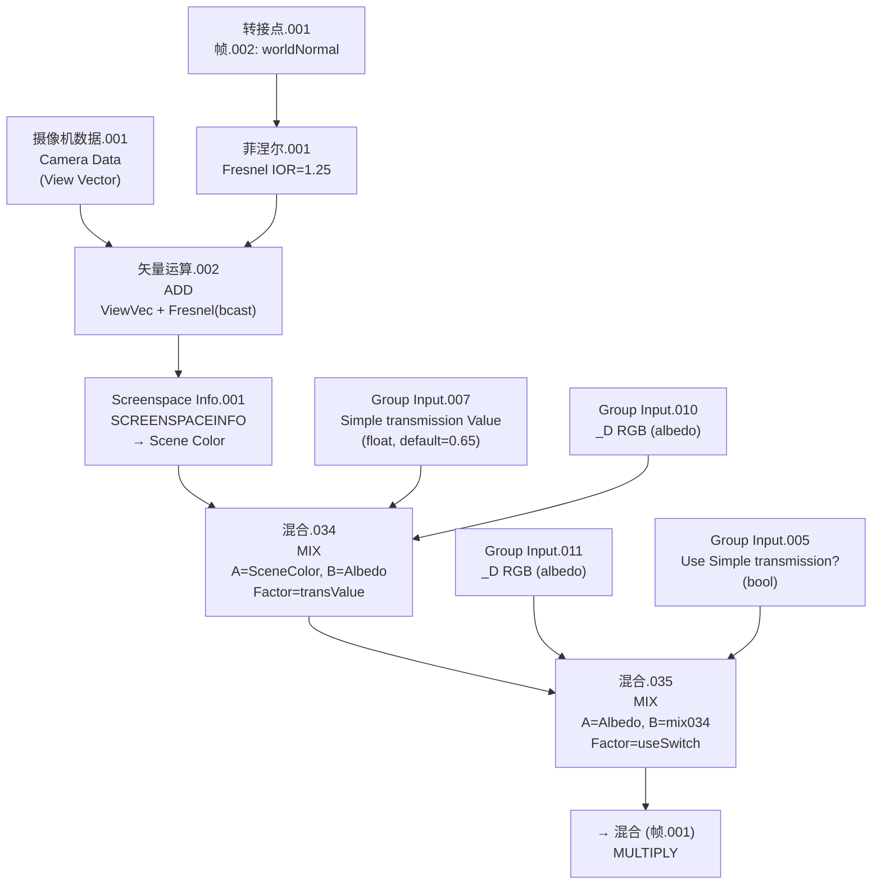

# 🔬 帧.069 — Simple Transmission 详细分析

> **溯源**：`Arknights: Endfield_PBRToonBase`（`M_actor_pelica_cloth_04`）
> **日期**：2026-03-06（MCP 实时提取）
> **群组**：`Arknights: Endfield_PBRToonBase`（437 节点）
> **上级架构**：顶层帧模块；输出流入 `帧.001`（MULTIPLY 混合）

---

## 📋 模块概述

| 属性 | 值 |
|------|-----|
| 帧编号 | `帧.069`（中文命名，独立功能模块） |
| 标签 | `Simple transmission` |
| 节点总数 | 10 |
| 子帧 | 无 |
| 子群组 | 无（全为内置节点 + Goo Engine 专有节点） |
| 运算节点 | 2× MIX、1× VECT_MATH(ADD)、1× FRESNEL、1× SCREENSPACEINFO、1× CAMERA |
| 职责 | 屏幕空间伪透射效果：将 Albedo 与背景场景色混合，以 Fresnel 偏移采样位置，通过开关和数值控制透射强度 |

---

## 🗂️ 节点清单

| 节点名 | 类型 | 说明 |
|--------|------|------|
| `摄像机数据.001` | `CAMERA` | 获取相机 View Vector |
| `菲涅尔.001` | `FRESNEL` | 菲涅尔因子，IOR=1.25，Normal 来自 帧.002 |
| `矢量运算.002` | `VECT_MATH (ADD)` | ViewVector + Fresnel(broadcast) = 偏移后的屏幕采样坐标 |
| `Screenspace Info.001` | `SCREENSPACEINFO` | Goo Engine 专有：采样场景色（背景/后层）于 View Position |
| `混合.034` | `MIX (MIX, clamp)` | 场景色 lerp 到 Albedo，权重 = Simple transmission Value |
| `混合.035` | `MIX (MIX, clamp)` | Albedo lerp 到 混合.034，权重 = Use Simple transmission? |
| `Group Input.005` | `GROUP_INPUT` | 提供 `Use Simple transmission？`（BOOLEAN） |
| `Group Input.007` | `GROUP_INPUT` | 提供 `Simple transmission Value`（VALUE） |
| `Group Input.010` | `GROUP_INPUT` | 提供 `_D(sRGB)R.G.B`（RGBA，给混合.034 的 B 端） |
| `Group Input.011` | `GROUP_INPUT` | 提供 `_D(sRGB)R.G.B`（RGBA，给混合.035 的 A 端） |

---

## 📥 外部输入来源（入边）

| 来源节点 | 来源 Socket | 目标节点 | 目标 Socket | 类型 | 说明 |
|----------|------------|----------|------------|------|------|
| `转接点.001`（`帧.002`） | `Output` | `菲涅尔.001` | `Normal` | VECTOR | 世界/切线空间法线，来自法线处理帧 |
| `Group Input.005` | `Use Simple transmission？` | `混合.035` | `Factor` | BOOLEAN | 透射功能开关（0=关，1=开） |
| `Group Input.007` | `Simple transmission Value` | `混合.034` | `Factor` | VALUE | 透射混合权重（default 0.65） |
| `Group Input.010` | `_D(sRGB)R.G.B` | `混合.034` | `B (RGBA)` | RGBA | Albedo 贴图颜色（混合.034 的不透明端） |
| `Group Input.011` | `_D(sRGB)R.G.B` | `混合.035` | `A (RGBA)` | RGBA | Albedo 贴图颜色（关闭透射时的直通值） |

> **注**：`摄像机数据.001` 和 `Screenspace Info.001` 为场景隐式输入，不经由群组接口传入。

---

## 📤 外部输出（出边）

| 来源节点 | 来源 Socket | 目标节点 | 目标 Socket | 类型 | 下游帧 |
|----------|------------|----------|------------|------|-------|
| `混合.035` | `Result (RGBA)` | `混合` | `A (RGBA)` | RGBA | `帧.001`（MULTIPLY 混合） |

---

## 🔗 子群组

无子群组（GROUP 类型节点）。

---

## 📊 计算流程



---

## 📌 核心链路说明

### 链路 A — 屏幕空间背景采样

```
Camera.ViewVector  +  float3(fresnel, fresnel, fresnel)
    ↓ ADD (矢量运算.002)
偏移视图坐标
    ↓ View Position
ScreenspaceInfo.SceneColor   ← 采样当前帧缓冲背景色（透射光源）
```

- `菲涅尔.001`（IOR=1.25，使用来自 帧.002 的法线）产生边缘亮度因子
- 将该标量 broadcast 为 Vec3 后叠加到 View Vector，产生微小屏幕偏移
- `SCREENSPACEINFO`（Goo Engine 专有节点）在该偏移坐标处采样场景色，模拟折射/透射背景

### 链路 B — 双重混合开关

```
SceneColor ──┐
             ├─ mix(Factor=Simple_transmission_Value) ─→ transBlend
AlbedoRGB ──┘ (混合.034, clamp)

AlbedoRGB ──┐
             ├─ mix(Factor=Use_Simple_transmission?) ─→ finalColor
transBlend ─┘ (混合.035, clamp)
```

- `混合.034`：**场景色与 Albedo 的数值混合**（0→纯背景色，1→纯 Albedo，default=0.65）
  → 透射强度越高，背景透过越明显
- `混合.035`：**功能开关**（`Use Simple transmission?` 为 bool/0-1）
  → 0（关闭）：直接输出 Albedo，不计算透射
  → 1（开启）：输出 混合.034 的结果（Albedo + 背景混合）

---

## 💻 HLSL 等价

```hlsl
// =============================================================================
// 帧.069 — Simple Transmission
// 群组：Arknights: Endfield_PBRToonBase  |  溯源：MCP 实时提取 2026-03-06
// 注：SCREENSPACEINFO 为 Goo Engine 专有节点，Unity 中需替换为 GrabPass / OpaqueTexture
// =============================================================================

// --- 入参 ---
// worldNormal       : float3  ←  帧.002 (转接点.001)
// albedoRGB         : float3  ←  _D(sRGB)R.G.B（贴图采样，sRGB 转线性）
// useSimpleTrans    : float   ←  Use Simple transmission？（bool，0 or 1）
// simpleTransValue  : float   ←  Simple transmission Value（default 0.65）
// (implicit) _CameraViewVector : float3  ←  相机视线向量（世界空间）
// (implicit) _OpaqueTexture    : Texture2D  ←  屏幕背景纹理（场景色）

float3 Frame069_SimpleTransmission(
    float3 worldNormal,
    float3 albedoRGB,
    float  useSimpleTrans,
    float  simpleTransValue,
    float3 cameraViewVec,
    float2 screenUV           // 当前像素屏幕 UV
)
{
    // --- Step 1: Fresnel（视角依赖透射权重，用于偏移采样坐标）---
    // Blender Fresnel: 1 - saturate(dot(N, V)) 的近似（with IOR）
    // IOR=1.25 → 边缘处 fresnel 较大（约0.04 at center, 1.0 at grazing）
    float ior = 1.25;
    float NdotV = saturate(dot(worldNormal, -cameraViewVec)); // 视角夹角
    float fresnel = pow(1.0 - NdotV, 1.0 + ior * 0.5);       // 近似 Blender Fresnel
    fresnel = saturate(fresnel);

    // --- Step 2: 视图偏移（矢量运算.002 ADD）---
    // Fresnel 标量 broadcast 为 float3，叠加到 View Vector
    float3 offsetViewPos = cameraViewVec + float3(fresnel, fresnel, fresnel);

    // --- Step 3: 屏幕空间背景采样（SCREENSPACEINFO → Scene Color）---
    // Unity URP 替换：使用 _CameraOpaqueTexture + ComputeGrabScreenPos
    // 此处以 screenUV 偏移模拟（需将 offsetViewPos 投影到屏幕 UV）
    float2 offsetScreenUV = screenUV + offsetViewPos.xy * 0.01; // 概念性近似
    float3 sceneColor = SAMPLE_TEXTURE2D(_CameraOpaqueTexture,
                                         sampler_CameraOpaqueTexture,
                                         offsetScreenUV).rgb;

    // --- Step 4: 混合.034 — 场景色 lerp 到 Albedo（clamp）---
    // A = sceneColor, B = albedoRGB, Factor = simpleTransValue
    float3 transBlend = saturate(lerp(sceneColor, albedoRGB, simpleTransValue));

    // --- Step 5: 混合.035 — 功能开关（clamp）---
    // A = albedoRGB, B = transBlend, Factor = useSimpleTrans (0 or 1)
    float3 result = saturate(lerp(albedoRGB, transBlend, useSimpleTrans));

    return result;
}
```

---

## ⚙️ 特化参数

| 参数名 | 类型 | 默认值 | 说明 |
|--------|------|--------|------|
| `Use Simple transmission？` | BOOLEAN | false | 功能总开关；关闭时模块直通 Albedo |
| `Simple transmission Value` | VALUE | 0.65 | 透射混合权重（0=纯背景，1=纯 Albedo）；default 0.65 偏向不透明 |
| `菲涅尔.001.IOR` | hardcoded | 1.25 | 菲涅尔折射率；影响边缘采样偏移量，非材质参数 |

---

## 📌 与其他帧的边界

| 方向 | 帧 | 传递内容 | Socket |
|------|----|---------|--------|
| 接收 | `帧.002`（法线处理帧） | 世界/切线法线（经过 DecodeNormal/NormalStrength） | `转接点.001.Output → 菲涅尔.001.Normal` |
| 输出 | `帧.001`（最终合成帧） | 透射混合后的颜色（RGBA） | `混合.035.Result → 混合.A (MULTIPLY)` |

---

## 💡 设计要点

| 要点 | 说明 |
|------|------|
| **假折射** | 用 Fresnel 标量偏移 ViewVector，再经 ScreenspaceInfo 采样背景，效果为"伪折射"而非物理正确透射 |
| **双层控制** | 内层（混合.034）控制透明度强度，外层（混合.035）作布尔开关 — 两层解耦便于美术控制 |
| **SCREENSPACEINFO** | Goo Engine 专有节点，标准 Blender 无法使用；Unity 中需 GrabPass 或 `_CameraOpaqueTexture` 替代 |
| **clamp** | 两个 MIX 节点均启用 `clamp_factor`，防止负值/超白 |
| **无子群组** | 本帧全为基础节点，逻辑简单清晰，不依赖任何子群组 |

---

## 🎮 Unity URP 迁移要点

| Blender 节点 | Unity URP 替代 | 说明 |
|-------------|---------------|------|
| `SCREENSPACEINFO.Scene Color` | `_CameraOpaqueTexture` + `SampleSceneColor()` | 需在 Pass 中设置 `GrabPass {}` 或开启 Opaque Texture |
| `CAMERA.View Vector` | `GetWorldSpaceViewDir(positionWS)` | URP 内置函数 |
| `FRESNEL (Blender)` | `pow(1 - NdotV, 5)` 或 `FresnelEffect(N, V, power)` | Schlick 近似，IOR=1.25 对应 power≈2.5 |
| `VECT_MATH ADD` | `viewDir + float3(fresnel, fresnel, fresnel)` | 直接向量加法 |
| `MIX (MIX)` | `lerp(A, B, t)` | Blender Mix 等价于 HLSL lerp |
| 功能开关 `bool` | `[Toggle] _UseSimpleTrans ("Use Simple Transmission", Float) = 0` | ShaderLab Property |

---

## ❓ 待确认

- [ ] `矢量运算.002` 的第一输入是否为 Camera View Vector（而非某个从 帧.002 传入的切线空间向量）？需 Blender 中目视连线确认
- [ ] `Screenspace Info.001.View Position` 接受的坐标空间是否为视图空间还是屏幕 UV？（Goo Engine 节点文档需查阅）
- [ ] `混合.035.Factor` 接受 BOOLEAN — Blender 中 bool 会 clamp 到 0/1，Unity 可用 `step(0.5, value)` 或直接 float toggle
- [ ] `帧.001` 中的 `混合 (MULTIPLY)` 将 透射色 与何值相乘？需补充 帧.001 分析

---
