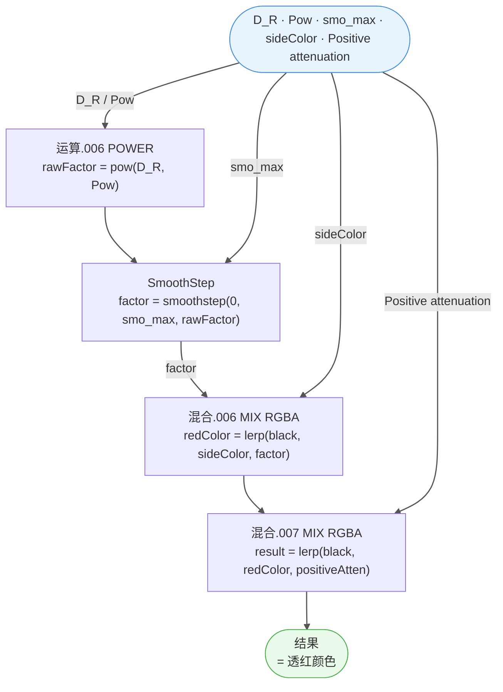

# Front transparent red

> 溯源：`docs/raw_data/Front_transparent_red_20260306.json` · 8 节点
> HLSL 实现：`hlsl/M_actor_pelica_face_01/SubGroups/SubGroups.hlsl` — `FrontTransparentRed()` 函数
> 首次引用：`M_actor_pelica_face_01` / `Arknights: Endfield_PBRToonBaseFace`

---

## 接口

| 📥 输入 | 类型 | 来源 |
|---------|------|------|
| `smo_max` | Float | Group Input `Front R Smo`（SmoothStep 上限） |
| `Positive attenuation` | Float | 上游正面衰减因子（正面朝向越强效果越明显） |
| `sideColor` | Color | 最终颜色的 A 端（无透红时的原始颜色） |
| `D_R` | Float | `_D.R`（Diffuse 贴图红色通道，皮肤红色越深透红越强） |
| `Pow` | Float | Group Input `Front R Pow`（衰减指数，默认 2.0） |

| 📤 输出 | 类型 | 下游 |
|---------|------|------|
| `结果` | Color | 叠加透红后的面部颜色 |

---

## 🔗 内部节点

| 节点 | 类型 | 作用 |
|------|------|------|
| `运算.006` | MATH (POWER) | `pow(D_R, Pow)` = 红通道幂次衰减 |
| `群组.010` | GROUP ([`SmoothStep`](SmoothStep.md)) | `SmoothStep(0, smo_max, pow_result)` = 平滑阶梯 |
| `混合.006` | MIX (RGBA) | `lerp(black, sideColor, smoothStep_factor)` = 透红颜色强度 |
| `混合.007` | MIX (RGBA) | `lerp(black, 混合.006, Positive_attenuation)` = 正面衰减控制 |

中间转接点：

| 转接点 | 传递变量 |
|--------|---------|
| `转接点.046` | pow(D_R, Pow) 结果 |
| `转接点.082` | sideColor |

---

## 📊 计算流程



---

## 🧮 等价公式

```
rawFactor = pow(D_R, Pow)
factor    = smoothstep(0, smo_max, rawFactor)
redColor  = sideColor × factor
result    = redColor × positiveAttenuation
```

**物理含义**：模拟皮肤次表面散射（SSS）的正面透红效果。`D_R`（Diffuse 红通道）越高的区域（如耳朵、嘴唇），透红效果越强。`Pow` 控制衰减曲线的陡峭度，`smo_max` 控制过渡范围。

---

## 💻 HLSL 等价

```cpp
// --- Front transparent red ---
// 面部皮肤次表面散射近似：正面透红效果
// 模拟光线穿透薄皮肤区域（耳朵、嘴唇）产生的红色散射光

float4 FrontTransparentRed(
    float  smoMax,              // SmoothStep 上限（Front R Smo）
    float  positiveAttenuation, // 正面衰减因子
    float4 sideColor,           // 原始颜色（无透红时的基底）
    float  D_R,                 // Diffuse 贴图红通道
    float  frontPow             // 衰减指数（Front R Pow，默认 2.0）
)
{
    // Step 1: 红通道幂次衰减
    float rawFactor = pow(D_R, frontPow);

    // Step 2: 平滑阶梯过渡
    float factor = SmoothStepCustom(0.0, smoMax, rawFactor);

    // Step 3: 颜色混合（黑色 → sideColor，由 factor 控制）
    float4 redColor = sideColor * factor;

    // Step 4: 正面衰减（黑色 → redColor，由 positiveAttenuation 控制）
    return redColor * positiveAttenuation;
}
```

---

## 📝 备注

- ⚠️ **SSS 近似而非物理 SSS**：这不是基于 BSSRDF 的真实次表面散射，而是一种基于 Diffuse 红通道的简化视觉近似，适用于卡通渲染的面部透红效果。
- **`sideColor` 来源**：在主群组中，sideColor 来自 `Front R Color`（Group Input），即美术指定的透红颜色（通常为暖红/橙红色调）。
- **`Positive attenuation` 来源**：在主群组中，此值来自 `dot(N, V)` 的正面衰减计算（正面朝向越强，透红越明显）。
- **`D_R` 的语义**：`_D` 贴图的 R 通道。皮肤区域 R 值较高（偏红），因此天然适合作为透红强度的驱动因子。
- **调用子群组**：内部调用 [`SmoothStep`](SmoothStep.md)（已有文档）。

---

## ❓ 待确认

- [ ] `Positive attenuation` 的具体上游计算：是 `saturate(dot(N, V))` 还是其他变体？需追踪主群组中连线
- [ ] `混合.006` 和 `混合.007` 的 A 端默认值：JSON 中未显示，推测为黑色 `(0,0,0,1)`
