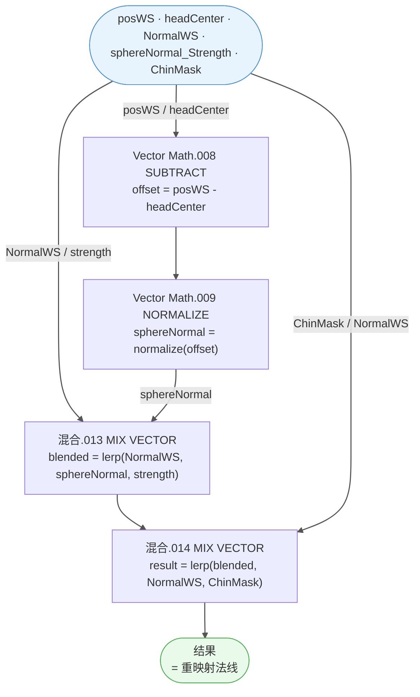

# Recalculate normal

> 溯源：`docs/raw_data/Recalculate_normal_20260306.json` · 12 节点
> HLSL 实现：`hlsl/M_actor_pelica_face_01/SubGroups/SubGroups.hlsl` — `RecalculateNormal()` 函数
> 首次引用：`M_actor_pelica_face_01` / `Arknights: Endfield_PBRToonBaseFace`

---

## 接口

| 📥 输入 | 类型 | 来源 |
|---------|------|------|
| `sphereNormal_Strength` | Float | Group Input（球面法线混合强度，0 = 纯原始法线） |
| `headCenter` | Vector | 几何属性（头部中心世界坐标，骨骼驱动） |
| `posWS` | Vector | 顶点世界坐标 |
| `NormalWS` | Vector | 原始世界空间法线 |
| `ChinMask` | Float | 下巴遮罩贴图值（0 = 面部区域使用球面法线，1 = 下巴区域保留原始法线） |

| 📤 输出 | 类型 | 下游 |
|---------|------|------|
| `结果` | Vector | 重映射后的世界空间法线 → 帧.002 N |

---

## 🔗 内部节点

| 节点 | 类型 | 作用 |
|------|------|------|
| `Vector Math.008` | VECT_MATH (SUBTRACT) | `posWS - headCenter` = 顶点到头部中心偏移 |
| `Vector Math.009` | VECT_MATH (NORMALIZE) | 归一化偏移向量 = 球面法线方向 |
| `混合.013` | MIX (VECTOR) | `lerp(NormalWS, sphereNormal, sphereNormal_Strength)` = 原始法线与球面法线混合 |
| `混合.014` | MIX (VECTOR) | `lerp(混合.013 结果, NormalWS, ChinMask)` = 下巴区域还原原始法线 |

中间转接点（路由节点）：

| 转接点 | 传递变量 |
|--------|---------|
| `转接点.115` | sphereNormal_Strength |
| `转接点.114` | sphereNormal（归一化后） |
| `转接点.118` | posWS |
| `转接点.119` | headCenter |
| `转接点.122` | NormalWS |

---

## 📊 计算流程



---

## 🧮 等价公式

设顶点世界坐标为 **P**，头部中心为 **C**，原始法线为 **N**：

```
sphereNormal = normalize(P - C)
blended      = lerp(N, sphereNormal, strength)
result       = lerp(blended, N, chinMask)
```

当 `strength = 1, chinMask = 0` 时，法线完全替换为球面方向；
当 `chinMask = 1` 时，无论 strength 如何，法线恢复为原始 NormalWS。

---

## 💻 HLSL 等价

```cpp
// --- Recalculate normal ---
// 面部球面法线重映射：将面部法线球面化以获得柔和平滑的光影过渡
// 下巴区域通过 ChinMask 保留原始法线（下巴需要独立的 Lambert 阴影）

float3 RecalculateNormal(
    float  sphereNormalStrength,  // 球面法线混合强度 [0,1]
    float3 headCenter,            // 头部中心世界坐标（骨骼驱动）
    float3 posWS,                 // 顶点世界坐标
    float3 normalWS,              // 原始世界空间法线
    float  chinMask               // 下巴遮罩（1 = 保留原始法线）
)
{
    // Step 1: 球面法线 = 顶点到头部中心方向
    float3 sphereNormal = normalize(posWS - headCenter);

    // Step 2: 原始法线与球面法线混合
    float3 blended = lerp(normalWS, sphereNormal, sphereNormalStrength);

    // Step 3: 下巴区域还原原始法线
    return lerp(blended, normalWS, chinMask);
}
```

---

## 📝 备注

- ⚠️ **无对应 HDRP/URP 标准函数**：这是面部着色专用的球面法线重映射技术，常见于卡通渲染面部处理（如原神、明日方舟等）。
- **骨骼数据传递**：`headCenter` 需要通过 C# 脚本从骨骼（如头部骨骼的 `transform.position`）写入 `MaterialPropertyBlock` 或顶点属性。
- **ChinMask 分离**：下巴区域需要保留原始法线以产生清晰的 Lambert 阴影（`chinLambertShadow`），球面法线会使下巴区域过于平滑。
- **帧.015 sphereNormal**：JSON 中的 Frame 标签仅标注了球面法线计算部分，混合逻辑位于帧外。

---

## ❓ 待确认

- [ ] `headCenter` 对应的具体骨骼名称（Head bone 的世界坐标？）
- [ ] `sphereNormal_Strength` 在本材质中的默认值（JSON 中 Group Input 默认为 0.0，表示默认不启用球面法线）
